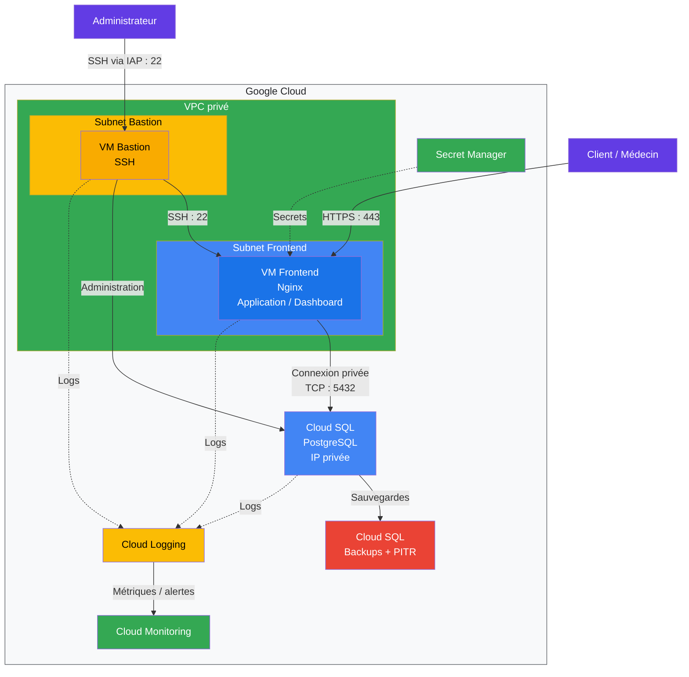
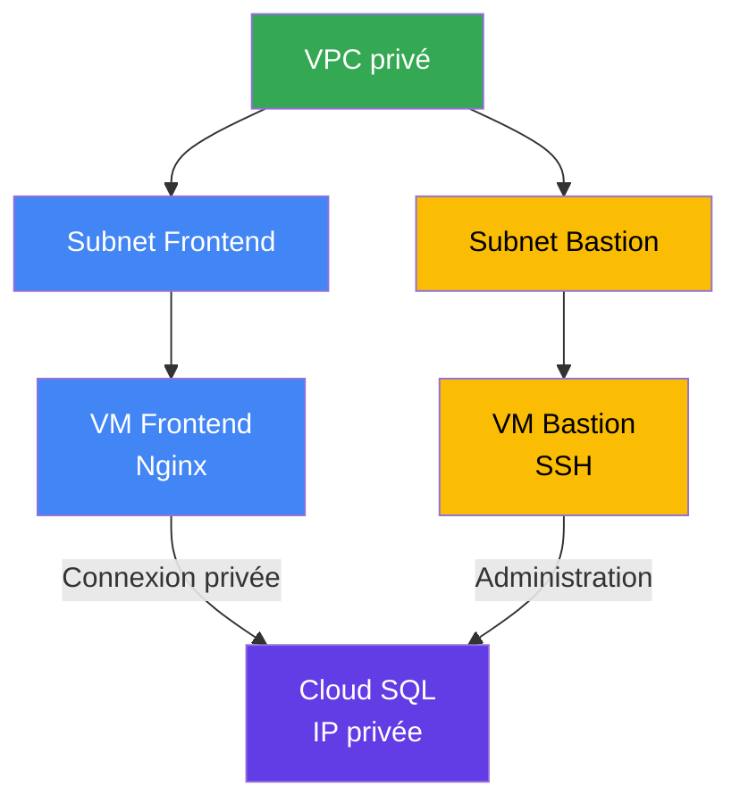
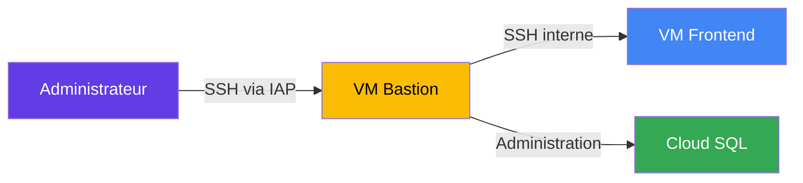
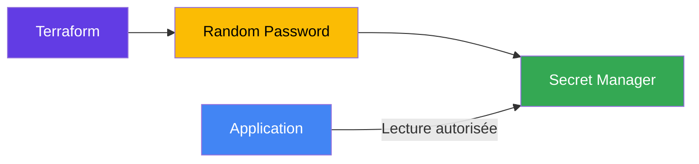
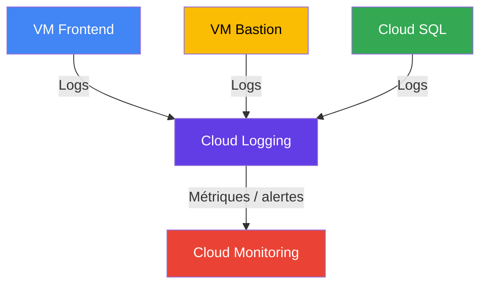
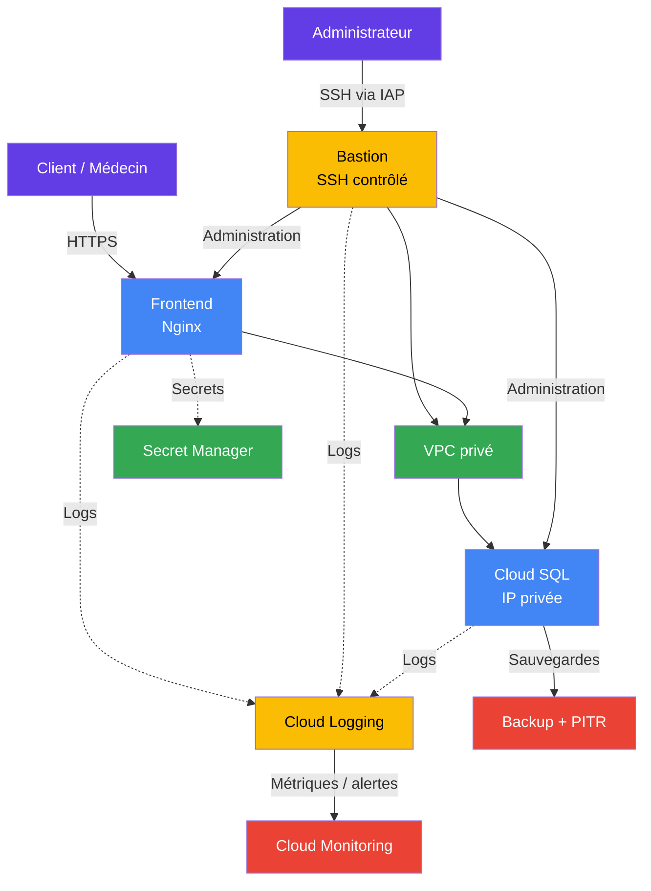

# MediRDV — Infrastructure Google Cloud

## Présentation du projet

Le projet **MediRDV** consiste à mettre en place une infrastructure sécurisée sur **Google Cloud Platform (GCP)** pour héberger une application de gestion de rendez-vous médicaux.

L'architecture repose sur plusieurs services Google Cloud :

- un **VPC privé** pour isoler les ressources ;
- une **VM Frontend** exécutant Nginx ;
- une **VM Bastion** dédiée aux connexions d'administration SSH ;
- une instance **Cloud SQL PostgreSQL** accessible uniquement en IP privée ;
- **Secret Manager** pour stocker les informations sensibles ;
- **Cloud Logging** pour centraliser les logs ;
- **Cloud Monitoring** pour superviser l'infrastructure ;
- des **sauvegardes Cloud SQL** et le **Point-in-Time Recovery (PITR)**.

## Architecture globale

## Objectifs

Les principaux objectifs de l'infrastructure sont :

- isoler les ressources dans un réseau privé ;
- limiter l'exposition des services sur Internet ;
- sécuriser l'accès à la base de données ;
- séparer les accès utilisateurs des accès d'administration ;
- centraliser les logs ;
- surveiller les ressources Google Cloud ;
- protéger les données grâce aux sauvegardes ;
- automatiser le déploiement avec Terraform.

## Architecture réseau

Le projet utilise un VPC contenant plusieurs sous-réseaux.


### Subnets

| Subnet | CIDR | Utilisation |
|---|---|---|
| `subnet-frontend` | `10.1.0.0/16` | VM Frontend |
| `subnet-bastion` | `10.2.0.0/24` | VM Bastion |

Le subnet frontend est destiné aux ressources applicatives.

Le subnet bastion est destiné aux ressources utilisées pour l'administration.

## VM Frontend

La VM frontend héberge actuellement un serveur **Nginx**.

Elle est destinée à fournir :

- le dashboard d'administration ;
- l'interface client ;
- l'interface médecin ;
- le point d'entrée HTTP de l'application.

La VM est connectée au subnet frontend.

### Configuration
```

frontend = { subnet = "frontend" network\_ip = ""

tags = \[ "frontend", "internal-ssh" \]

public\_ip = true

startup = \<\<-EOF #!/bin/bash

apt-get update apt-get install -y docker.io

systemctl enable docker systemctl start docker

docker pull nginx

docker run -d  --name nginx  --restart unless-stopped  -p 80:80  nginx EOF }

```

Le script de démarrage installe Docker puis lance un conteneur Nginx.

## VM Bastion

La VM Bastion est utilisée pour l'administration de l'infrastructure.

Elle permet notamment d'effectuer des connexions SSH vers :

- la VM Frontend ;
- les ressources nécessitant une administration interne.
```

bastion = { subnet = "bastion" network\_ip = ""

tags = \[ "bastion" \]

public\_ip = true

startup = "" }

```

### Sécurité SSH

Le Bastion dispose d'une IP publique afin de permettre une connexion administrative.

Cependant, l'accès TCP/22 doit être limité par des règles firewall afin d'éviter d'autoriser SSH depuis Internet sans restriction.

L'objectif est d'obtenir une architecture similaire à :


## Cloud SQL PostgreSQL

La base de données est hébergée sur **Cloud SQL PostgreSQL**.

Elle contient notamment les données liées :

- aux rendez-vous ;
- aux clients ;
- aux utilisateurs ;
- aux médecins ;
- aux informations nécessaires à l'application.

### Configuration

| Configuration | Valeur |
|---|---|
| Moteur | PostgreSQL |
| Version | PostgreSQL 15 |
| Tier | `db-f1-micro` |
| IP publique | Désactivée |
| IP privée | Activée |
| VPC | VPC du projet |
| Backup | Activé |
| PITR | À configurer |
| Protection suppression | Désactivée actuellement |

### Configuration Terraform
```

resource "google_sql_database_instance" "postgres_instance" { name = "cloudsql-postgres-instance" database_version = "POSTGRES_15" region = var.region

settings { tier = "db-f1-micro"

ip_configuration { ipv4_enabled = false private_network = "projects/${var.project_id}/global/networks/votre-vpc-name" }

backup\_configuration { enabled = true } }

deletion\_protection = false }

```

L'adresse IP publique est désactivée :
```

ipv4\_enabled = false

```

La base de données doit donc être accessible uniquement depuis les ressources autorisées du réseau privé.

## Base de données

La base PostgreSQL est créée avec Terraform :
```

resource "google_sql_database" "mydatabase" { name = "ma_base_de_donnees" instance = google_sql_database_instance.postgres\_instance.name }

```

## Utilisateur PostgreSQL

Un utilisateur PostgreSQL est également créé :
```

resource "google_sql_user" "db_user" { name = "mon_utilisateur" instance = google_sql_database_instance.postgres_instance.name password = "mon_mot_de_passe_secret" }

```

> **Attention :** le mot de passe ne doit pas être écrit en clair dans le code Terraform. Il est recommandé d'utiliser `random_password` et `Google Secret Manager`.

## Secret Manager

Les informations sensibles doivent être stockées dans **Google Secret Manager**.

L'objectif est d'éviter de stocker directement les mots de passe dans :

- Git ;
- `terraform.tfvars` ;
- les fichiers Terraform ;
- le code de l'application.

L'architecture cible est :


## Sauvegardes et récupération

Cloud SQL utilise les sauvegardes automatiques afin de protéger les données.
```

backup\_configuration { enabled = true }

```

Le **Point-in-Time Recovery (PITR)** doit également être activé afin de permettre une récupération de la base à un instant précis.

La configuration cible est :
```

backup_configuration { enabled = true point_in_time_recovery_enabled = true transaction_log_retention_days = 7 }

```

La conservation des journaux de transactions est prévue pour une durée de **7 jours**.

## Observabilité

L'infrastructure utilise les services Google Cloud suivants :

- Cloud Logging ;
- Cloud Monitoring.

### Cloud Logging

Cloud Logging permet de centraliser les logs provenant notamment :

- de la VM Frontend ;
- de la VM Bastion ;
- de Cloud SQL ;
- des autres services Google Cloud.


### Cloud Monitoring

Cloud Monitoring permet de suivre :

- l'état des VM ;
- les métriques Cloud SQL ;
- les erreurs ;
- l'utilisation des ressources ;
- les problèmes potentiels de l'infrastructure.

## Terraform

L'infrastructure est entièrement déployée avec Terraform.

Les principaux modules sont :
```

.
├── main.tf 
├── variables.tf 
├── outputs.tf 
│ 
└── modules/ 
    ├── network/ 
    ├── vm/ 
        ├── database/ 
        ├── application/ 
        └── observability/

```

### Module Network

Le module `network` crée et configure :

- le VPC ;
- le subnet frontend ;
- le subnet bastion ;
- les paramètres réseau nécessaires à Cloud SQL.

### Module VM

Le module `vm` permet de créer :

- la VM Frontend ;
- la VM Bastion ;
- les interfaces réseau ;
- les disques ;
- les clés SSH ;
- les startup scripts.

### Module Database

Le module `database` permet de créer :

- l'instance Cloud SQL ;
- la base PostgreSQL ;
- l'utilisateur PostgreSQL ;
- le mot de passe ;
- le secret associé.

### Module Application

Le module `application` permet de configurer l'application et ses connexions aux ressources nécessaires.

### Module Observability

Le module `observability` permet de configurer les éléments liés à :

- Cloud Logging ;
- Cloud Monitoring ;
- la collecte des événements.

## Exemple de module VM
```

module "vm" { for\_each = var.vms

source = "./modules/vm"

project_id = var.project_id

name = each.key machine\_type = "e2-medium" zone = var.zone

subnetwork = google_compute_subnetwork.subnets\[each.value.subnet\].id

network_ip = each.value.network_ip instance_tags = each.value.tags public_ip = each.value.public\_ip

ssh_public_key = var.ssh_public_key startup\_script = each.value.startup }

```

## Prérequis

Avant de déployer l'infrastructure, il faut disposer de :

- Terraform installé ;
- un projet Google Cloud ;
- les permissions IAM nécessaires ;
- les APIs Google Cloud nécessaires ;
- un compte disposant des droits suffisants pour créer les ressources.

### APIs utilisées

Les APIs principales sont :
```

compute.googleapis.com run.googleapis.com sqladmin.googleapis.com servicenetworking.googleapis.com secretmanager.googleapis.com logging.googleapis.com monitoring.googleapis.com

```

## Déploiement

### Initialiser Terraform
```

terraform init

```

### Vérifier la configuration
```

terraform validate

```

### Générer le plan
```

terraform plan

```

### Déployer l'infrastructure
```

terraform apply

```

Pour appliquer automatiquement sans confirmation :
```

terraform apply -auto-approve

```

## Sécurité

Les principales mesures de sécurité prévues sont :

- VPC privé ;
- séparation des subnets ;
- Cloud SQL sans IP publique ;
- accès à la base via réseau privé ;
- Bastion dédié à l'administration ;
- accès SSH limité par firewall ;
- gestion des secrets avec Secret Manager ;
- permissions IAM minimales ;
- sauvegardes Cloud SQL ;
- PITR ;
- Logging ;
- Monitoring.

## Points à justifier

Les choix d'architecture doivent être justifiés en fonction des besoins du projet.

| Besoin | Hypothèse | Solution retenue |
|---|---|---|
| Frontend | Dashboard admin et interfaces client/médecin | VM Nginx |
| Base de données | Rendez-vous, clients et utilisateurs | Cloud SQL PostgreSQL |
| Réseau | Communication privée entre les ressources | VPC + subnets |
| Administration | Connexion SSH aux ressources | VM Bastion |
| Sécurité SSH | Éviter l'exposition directe des VM | Firewall + accès contrôlé |
| Secrets | Protéger les mots de passe | Secret Manager |
| Sauvegardes | Protection des données | Backup + PITR |
| Observabilité | Suivi de l'infrastructure | Cloud Logging + Monitoring |

## Architecture de sécurité

## Bonnes pratiques

Pour un environnement de production, il est recommandé de :

- désactiver les IP publiques lorsque cela est possible ;
- limiter les règles firewall ;
- limiter les sources autorisées sur le port TCP/22 ;
- utiliser Secret Manager pour les secrets ;
- ne jamais stocker les mots de passe dans Git ;
- utiliser des comptes de service dédiés ;
- appliquer le principe du moindre privilège IAM ;
- activer `deletion_protection` sur Cloud SQL ;
- conserver des sauvegardes ;
- activer le PITR ;
- surveiller les logs et les métriques ;
- séparer les environnements de développement et de production.

## Protection contre la suppression

La configuration actuelle utilise :
```

deletion\_protection = false

```

Cela permet à Terraform de supprimer l'instance Cloud SQL.

Pour la production, il est recommandé d'utiliser :
```

deletion\_protection = true

```

Cela réduit le risque de suppression accidentelle de la base de données.

## Suppression de l'infrastructure

Pour supprimer l'infrastructure :
```

terraform destroy

```

Terraform demandera une confirmation.

Pour supprimer automatiquement :
```

terraform destroy -auto-approve

```

> **Attention :** la suppression de Cloud SQL peut entraîner une perte de données. Vérifiez toujours les sauvegardes avant toute suppression.

## Résumé

Le projet MediRDV met en place une infrastructure Google Cloud sécurisée et automatisée.

L'architecture repose sur :

- un VPC privé ;
- un subnet frontend ;
- un subnet bastion ;
- une VM Frontend Nginx ;
- une VM Bastion pour l'administration ;
- Cloud SQL PostgreSQL avec IP privée ;
- Secret Manager pour les secrets ;
- Backup et PITR pour la protection des données ;
- Cloud Logging pour les logs ;
- Cloud Monitoring pour la supervision ;
- Terraform pour automatiser le déploiement.

L'objectif principal est de **réduire l'exposition publique, contrôler les accès et assurer la disponibilité et la traçabilité de l'infrastructure**.