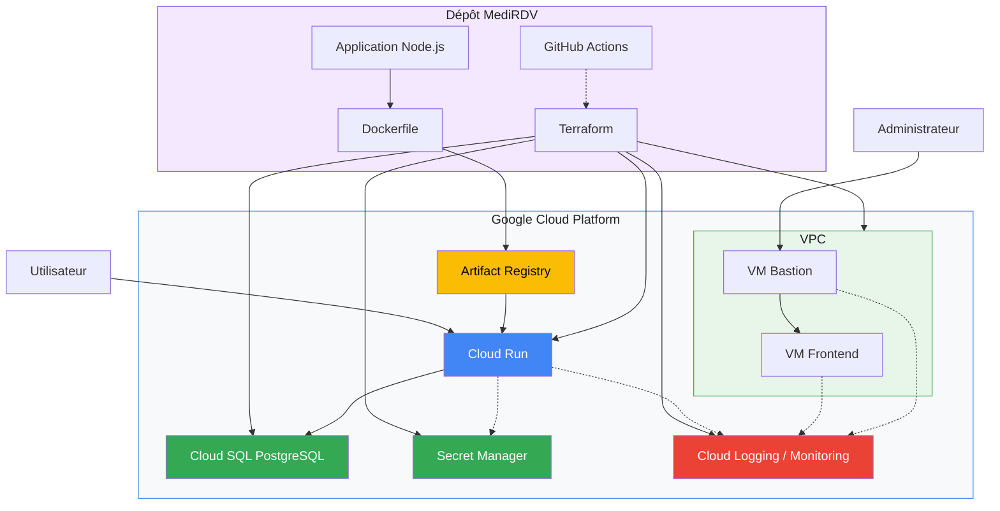

# MediRDV — Infrastructure as Code sur Google Cloud

## Présentation du projet

**MediRDV** est un projet de gestion de rendez-vous médicaux dont l'application et l'infrastructure sont déployées sur Google Cloud Platform (GCP).

Le projet utilise Docker pour empaqueter l'application et Terraform pour automatiser la création et la configuration des ressources cloud.

L'infrastructure s'appuie notamment sur :

- **Cloud Run** pour exécuter l'application conteneurisée ;
- **Artifact Registry** pour stocker les images Docker ;
- **Cloud SQL PostgreSQL** pour la base de données ;
- **Secret Manager** pour gérer le mot de passe de la base de données ;
- **Compute Engine** pour les machines virtuelles ;
- **VPC** pour organiser les communications réseau ;
- **Cloud Logging et Cloud Monitoring** pour la supervision ;
- **GitHub Actions** pour automatiser les opérations d'intégration et de déploiement selon le workflow configuré.

## Architecture globale



_Schéma conceptuel de l'architecture. Les flux effectifs dépendent de la configuration de chaque ressource._

## Structure du dépôt

L'organisation du projet est la suivante :

```
medirdv/
├── .gitignore
├── docker-compose.yml
├── README.md
│
├── .github/
│   └── workflows/
│       └── terraform.yml
│
├── app/
│   ├── Dockerfile
│   ├── package.json
│   ├── package-lock.json
│   ├── server.mjs
│   ├── deploiement.mjs
│   ├── gcp.mjs
│   ├── stockage.mjs
│   ├── README.md
│   └── public/
│       ├── app.js
│       ├── carte.js
│       ├── index.html
│       └── kit.css
│
└── terraform/
    ├── main.tf
    ├── providers.tf
    ├── variables.tf
    ├── outputs.tf
    ├── terraform.tfvars.exemple
    ├── README.md
    │
    ├── bootstrap/
    │   ├── main.tf
    │   └── README.md
    │
    └── modules/
        ├── application/
        │   ├── main.tf
        │   ├── variables.tf
        │   ├── outputs.tf
        │   └── README.md
        │
        ├── database/
        │   ├── main.tf
        │   ├── variables.tf
        │   ├── outputs.tf
        │   └── README.md
        │
        ├── network/
        │   ├── main.tf
        │   ├── variables.tf
        │   ├── outputs.tf
        │   └── README.md
        │
        ├── observability/
        │   ├── main.tf
        │   ├── dashboard.tf
        │   ├── variables.tf
        │   ├── outputs.tf
        │   └── README.md
        │
        └── vm/
            ├── main.tf
            ├── variables.tf
            ├── outputs.tf
            └── README.md
```

Les fichiers générés par Terraform, notamment le dossier `.terraform/` et les fichiers d'état, ne sont pas présentés ici, car ils ne constituent pas le code source à documenter ou à versionner.

## Organisation du projet

### Application — `app/`

Le dossier `app/` contient le code de l'application MediRDV.

| Fichier | Rôle |
| --- | --- |
| `server.mjs` | Point d'entrée du serveur Node.js |
| `deploiement.mjs` | Code lié au déploiement de l'application |
| `gcp.mjs` | Intégration avec Google Cloud |
| `stockage.mjs` | Gestion du stockage applicatif |
| `Dockerfile` | Instructions de construction de l'image Docker |
| `docker-compose.yml` | Configuration de l'environnement Docker local, à la racine |
| `public/` | Fichiers frontend : HTML, JavaScript et CSS |

Pour connaître les détails de l'application et son fonctionnement, consultez le README de l'application.

### Infrastructure — `terraform/`

Le dossier `terraform/` contient le code Infrastructure as Code.

Il comprend :

- `main.tf` : orchestration des modules ;
- `providers.tf` : configuration des versions Terraform, des providers et du backend ;
- `variables.tf` : paramètres de l'infrastructure ;
- `outputs.tf` : informations exposées après le déploiement ;
- `terraform.tfvars.exemple` : exemple de configuration des variables ;
- `bootstrap/` : configuration initiale du stockage distant de l'état Terraform ;
- `modules/` : modules réutilisables de l'infrastructure.

## Modules Terraform

Chaque module possède son propre README détaillant ses ressources, ses variables, ses outputs et son utilisation.

| Module | Rôle | Documentation |
| --- | --- | --- |
| `network` | VPC, subnets, Private Service Access et règles firewall | README Network |
| `vm` | Machines virtuelles Compute Engine, disques et interfaces réseau | README VM |
| `database` | Cloud SQL PostgreSQL, utilisateur, mot de passe et Secret Manager | README Database |
| `application` | Déploiement de l'application sur Cloud Run et configuration de ses connexions | README Application |
| `observability` | Dashboard Cloud Monitoring et politiques d'alerte | README Observability |

### Module Network

Le module `network` crée le réseau utilisé par les ressources de l'infrastructure.

Il configure le VPC, les subnets frontend et bastion, la plage d'adresses réservée à Private Service Access et les règles firewall nécessaires.

Documentation : [`terraform/modules/network/README.md`](./terraform/modules/network/README.md)

### Module VM

Le module `vm` crée des machines virtuelles Compute Engine à partir de la variable `vms`.

Il permet de configurer le type de machine, la zone, le subnet, les adresses IP, les tags réseau, les clés SSH et les scripts de démarrage.

Documentation : [`terraform/modules/vm/README.md`](./terraform/modules/vm/README.md) 

### Module Database

Le module `database` déploie une instance Cloud SQL PostgreSQL avec une adresse IP privée.

Il crée la base, l'utilisateur PostgreSQL et un mot de passe généré automatiquement, stocké dans Secret Manager. Il configure également les sauvegardes et la récupération à un instant précis selon les paramètres du module.

Documentation : [`terraform/modules/database/README.md`](./terraform/modules/database/README.md) 

### Module Application

Le module `application` configure le service Cloud Run et les paramètres nécessaires à sa connexion à la base de données.

Il reçoit notamment les informations de connexion Cloud SQL, le nom de la base, l'utilisateur et la référence du secret contenant le mot de passe.

Documentation : [`terraform/modules/application/README.md`](./terraform/modules/application/README.md) 

### Module Observability

Le module `observability` configure les outils de supervision de l'infrastructure.

Il comprend un dashboard Cloud Monitoring présentant des métriques de Cloud Run et Cloud SQL, ainsi que des politiques d'alerte pour les erreurs HTTP 5xx et une utilisation CPU élevée de Cloud SQL.

Documentation : [`terraform/modules/observability/README.md`](./terraform/modules/observability/README.md) 

## Bootstrap Terraform

Le dossier `terraform/bootstrap/` contient la configuration initiale nécessaire à la préparation du stockage distant de l'état Terraform.

Le backend principal utilise un bucket Google Cloud Storage pour conserver l'état de l'infrastructure.

Le bucket doit être créé et accessible avant l'initialisation du projet principal avec ce backend.

Pour les détails de la procédure, consultez le README du bootstrap.

## Prérequis

Avant de déployer l'infrastructure, vous devez disposer de :

- un projet Google Cloud ;
- Terraform version `1.6.0` ou supérieure ;
- Google Cloud CLI (`gcloud`) ;
- Docker pour construire et tester localement l'application ;
- les permissions IAM nécessaires à la création des ressources ;
- un bucket GCS pour le stockage de l'état Terraform ;
- les APIs Google Cloud requises.

Les APIs activées par le code Terraform principal comprennent :

- Compute Engine API ;
- Cloud Run API ;
- Cloud SQL Admin API ;
- Service Networking API ;
- Secret Manager API ;
- Cloud Logging API ;
- Cloud Monitoring API ;
- Artifact Registry API.

Le compte utilisé pour le déploiement doit disposer des autorisations nécessaires pour activer les APIs et créer les ressources correspondantes.

## Configuration Terraform

### 1\. Se placer dans le dossier Terraform

Depuis la racine du dépôt :

```bash
cd terraform
```

### 2\. Préparer le fichier de variables

Copiez le fichier d'exemple :

```
Copy-Item terraform.tfvars.exemple terraform.tfvars
```

Adaptez ensuite les valeurs à votre projet Google Cloud.

Les principales variables comprennent :

| Variable | Description |
| --- | --- |
| `project_id` | Identifiant du projet Google Cloud |
| `region` | Région des ressources |
| `zone` | Zone des machines virtuelles |
| `network_name` | Nom du VPC |
| `subnet_frontend_name` | Nom du subnet frontend |
| `subnet_frontend_cidr` | Plage IP du subnet frontend |
| `subnet_bastion_name` | Nom du subnet bastion |
| `subnet_bastion_cidr` | Plage IP du subnet bastion |
| `database_name` | Nom de la base PostgreSQL |
| `database_user` | Utilisateur PostgreSQL |
| `cloud_run_name` | Nom du service Cloud Run |
| `container_image` | Image Docker utilisée par Cloud Run |
| `ssh_public_keys` | Liste des clés SSH publiques |
| `vms` | Configuration des machines virtuelles à créer |

La variable `vms` contient une map d'objets. Chaque entrée définit le subnet, l'adresse IP privée, les tags réseau, l'utilisation d'une IP publique et le script de démarrage de la VM.

La liste exacte des variables et leurs valeurs par défaut sont définies dans `terraform/variables.tf`.

> **Sécurité :** ne versionnez pas `terraform.tfvars` si ce fichier contient des informations sensibles ou des paramètres propres à votre environnement. Le mot de passe PostgreSQL est géré par le module Database et ne doit pas être écrit en clair dans ce fichier.

## Déploiement de l'infrastructure

### 1\. Authentification Google Cloud

Connectez-vous avec Google Cloud CLI :

```bash
gcloud auth login
gcloud config set project VOTRE_PROJECT_ID
```

Pour les déploiements automatisés, privilégiez une identité dédiée et des permissions IAM minimales.

### 2\. Initialiser Terraform

Depuis le dossier `terraform/` :

```bash
terraform init
```

Cette commande télécharge les providers et initialise le backend configuré.

### 3\. Formater et valider le code

```bash
terraform fmt -recursive
terraform validate
```

### 4\. Prévisualiser les changements

```bash
terraform plan
```

Vérifiez les ressources qui seront créées, modifiées ou supprimées avant de poursuivre.

### 5\. Déployer l'infrastructure

```bash
terraform apply
```

Terraform demande une confirmation avant d'appliquer les changements.

Il est préférable de conserver cette confirmation lors d'un déploiement manuel.

## Outputs Terraform

Une fois le déploiement terminé, les informations exposées peuvent être consultées avec :

```bash
terraform output
```

Les outputs principaux définis dans `terraform/outputs.tf` sont :

| Output | Description |
| --- | --- |
| `cloud_run_url` | URL du service Cloud Run |
| `cloud_run_service_account` | Compte de service utilisé par Cloud Run |
| `vpc_id` | Identifiant du VPC |
| `subnet_frontend_id` | Identifiant du subnet frontend |
| `subnet_bastion_id` | Identifiant du subnet bastion |
| `cloud_sql_private_ip` | Adresse IP privée de Cloud SQL |
| `cloud_sql_instance` | Nom de l'instance Cloud SQL |

Pour consulter un output particulier :

```bash
terraform output cloud_run_url
terraform output cloud_sql_private_ip
terraform output cloud_sql_instance
```

## Application Docker

L'application dispose de son propre `Dockerfile` dans le dossier `app/`.

Pour construire l'image depuis la racine du dépôt :

```bash
docker build -t medirdv:local ./app
```

Pour lancer l'environnement local, consultez le `docker-compose.yml` situé à la racine et le README de l'application.

Le déploiement Cloud Run utilise la valeur de `container_image`. L'image doit être disponible dans un registre accessible par le service, notamment Artifact Registry si ce registre est utilisé pour le déploiement.

La création du dépôt Artifact Registry par Terraform ne construit pas automatiquement l'image Docker : la construction et la publication doivent être réalisées par une commande ou un pipeline adapté.

## Intégration continue et déploiement

Le dépôt contient un workflow GitHub Actions :

` .github/workflows/terraform.yml`

Ce workflow est destiné à automatiser les opérations Terraform définies dans sa configuration.

Les étapes effectivement exécutées, les événements déclencheurs, les contrôles et la méthode d'authentification dépendent du contenu de `terraform.yml`.

Pour les déploiements automatisés, utilisez de préférence Workload Identity Federation ou une méthode d'authentification sécurisée, sans clé de service persistante dans le dépôt.

## Sécurité

Les principales mesures de sécurité de l'infrastructure comprennent :

- un VPC personnalisé et des subnets séparés ;
- des règles firewall ciblées ;
- une adresse IP privée pour Cloud SQL ;
- la gestion du mot de passe de la base via Secret Manager ;
- des clés SSH configurables pour les VM ;
- la supervision via Cloud Monitoring ;
- le stockage distant de l'état Terraform ;
- la séparation du code applicatif et du code d'infrastructure.

Pour un environnement de production, il est recommandé de :

- limiter les permissions IAM au strict nécessaire ;
- éviter les adresses IP publiques lorsqu'elles ne sont pas indispensables ;
- limiter les sources autorisées pour SSH ;
- activer la protection contre la suppression de Cloud SQL ;
- protéger le bucket d'état Terraform et limiter son accès ;
- ne jamais versionner les fichiers d'état ou les secrets ;
- configurer les alertes et vérifier les sauvegardes ;
- protéger les branches et les secrets GitHub Actions.

## Nettoyage de l'infrastructure

Pour supprimer les ressources gérées par Terraform :

```bash
terraform destroy
```

Vérifiez attentivement le plan de suppression avant de confirmer.

> **Attention :** la suppression de Cloud SQL ou d'autres ressources persistantes peut entraîner une perte de données. Vérifiez les sauvegardes et les besoins de conservation avant toute suppression.

## Documentation complémentaire

- README de l'application
- README du bootstrap Terraform
- README du module Network
- README du module VM
- README du module Database
- README du module Application
- README du module Observability

## Conclusion

MediRDV combine une application conteneurisée, une infrastructure Google Cloud déclarative et des modules Terraform réutilisables.

Cette organisation sépare le code applicatif de l'infrastructure, facilite la maintenance et permet de déployer les ressources de manière reproductible.

Terraform orchestre les composants réseau, les machines virtuelles, la base de données, l'application Cloud Run et la supervision, tandis que Docker et GitHub Actions participent au processus de construction et de déploiement selon leur configuration respective.
