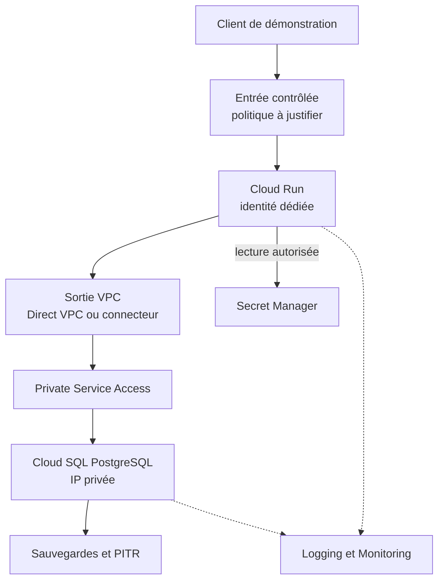
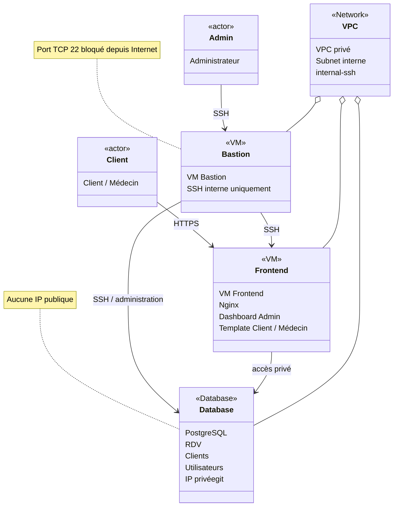

# Résumé du projet

 Mettre en place une architecture Google Cloud sécurisée :

- Client → entrée contrôlée → Cloud Run.
- Cloud Run avec une identité dédiée et des permissions minimales.
- Accès au VPC via Direct VPC ou VPC Connector.
- Cloud SQL PostgreSQL accessible uniquement en IP privée via Private Service Access.
- Secrets stockés dans Secret Manager.
- Sauvegardes Cloud SQL et PITR configurés.
- Logging et Monitoring activés.
- Documenter et justifier les choix de sécurité et d’architecture.

# principale question a ce pose sont:

| besoin | hypothès | prévue |
| :--- | :---: | ---: |
| vm frontend | dashboard admin (monitoring looger) switch template client/ medecin  | une vm ngnix relier a la bd provider usr acces   |
| base de donner| db rdv client / bd user | provider acces admin_reseaux  ip priver   |
| vpc | prive acees vpc entre la bd est le frontend  |  mise vpc avec un sous reseaux   |
|vm bastion | vm pbastion pour les connection ssh frontend base de donner| bloque les port tcp 22 exterieur avec un subnete internal-ssh





```teraforme

module "vm" {
  for_each = var.vms

  source = "./modules/vm"

  project_id = var.project_id

  name         = each.key
  machine_type = "e2-medium"
  zone         = var.zone

  subnetwork = google_compute_subnetwork.subnets[each.value.subnet].id

  network_ip    = each.value.network_ip
  instance_tags = each.value.tags
  public_ip     = each.value.public_ip

  ssh_public_key = var.ssh_public_key
  startup_script = each.value.startup
}

#module utiliser dans terraforme (resued du tp de hier)

  frontend = {
    subnet     = "frontend"
    network_ip = ""

    tags = [
      "frontend",
      "internal-ssh"
    ]

    public_ip = true

    startup = <<-EOF
      #!/bin/bash

      apt-get update
      apt-get install -y docker.io

      systemctl enable docker
      systemctl start docker

      docker pull nginx

      docker run -d \
        --name nginx \
        --restart unless-stopped \
        -p 80:80 \
        nginx
    EOF
  }

  bastion = {
    subnet     = "bastion"
    network_ip = ""

    tags = ["bastion"]

    public_ip = true

    startup = ""
  }

# partie PostgreSQL de terraforme 

resource "google_sql_database_instance" "postgres_instance" {
  name             = "cloudsql-postgres-instance"
  database_version = "POSTGRES_15"
  region           = var.region

  settings {
    tier = "db-f1-micro" # Type de machine (ex: db-f1-micro, db-custom-1-3840, etc.)

    ip_configuration {
      ipv4_enabled    = false # Désactive l'IP publique pour la sécurité
      private_network = "projects/${var.project_id}/global/networks/votre-vpc-name" # Remplacer par le nom ou l'ID de votre VPC
    }

    backup_configuration {
      enabled = true
    }
  }

  deletion_protection = false # Mettre à true en production pour éviter les suppressions accidentelles
}

resource "google_sql_database" "mydatabase" {
  name     = "ma_base_de_donnees"
  instance = google_sql_database_instance.postgres_instance.name
}

# 3. L'utilisateur PostgreSQL
resource "google_sql_user" "db_user" {
  name     = "mon_utilisateur"
  instance = google_sql_database_instance.postgres_instance.name
  password = "mon_mot_de_passe_secret" # Recommandé : utiliser une variable ou Secret Manager
}


```

