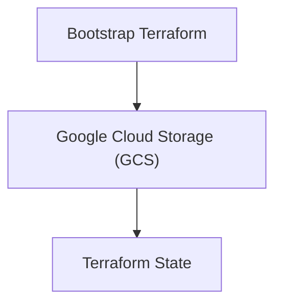
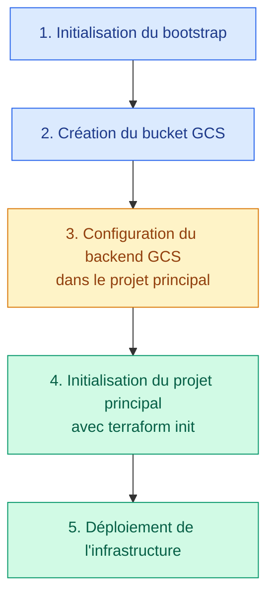

# Bootstrap Terraform

Le dossier `bootstrap` sert à créer les ressources nécessaires au fonctionnement du backend Terraform avant le déploiement de l'infrastructure principale.

## Objectif

Le bootstrap crée un bucket **Google Cloud Storage (GCS)** destiné à stocker le **Terraform State** de l'infrastructure principale.



Le Terraform State permet à Terraform de suivre les ressources qu'il gère et de connaître leur état actuel.

**Important :** le code de bootstrap crée le bucket GCS, mais ne configure pas lui-même ce bucket comme backend distant. Cette configuration doit être ajoutée au projet Terraform principal.

## Structure

Le bootstrap est volontairement minimaliste :

```
bootstrap/
└── main.tf
```

Toute la configuration est contenue dans le fichier [`main.tf`](./main.tf).

## Configuration

Le fichier `main.tf` contient :

- la version minimale de Terraform ;
- le provider Google Cloud ;
- le projet GCP ;
- la région ;
- la variable `project_id` ;
- la variable `region` ;
- le bucket GCS destiné au Terraform State ;
- le versioning du bucket ;
- l'accès uniforme au bucket ;
- l'output contenant le nom du bucket.

### Version de Terraform

```bash
terraform {
  required_version = ">= 1.6.0"

  required_providers {
    google = {
      source  = "hashicorp/google"
      version = "~> 6.0"
    }
  }
}
```

Le projet nécessite Terraform `1.6.0` ou une version supérieure et utilise le provider Google en version `6.x`.

### Provider Google Cloud

```hcl
provider "google" {
  project = var.project_id
  region  = var.region
}
```

Le provider utilise le projet et la région définis dans les variables Terraform.

L'authentification auprès de Google Cloud doit être configurée avant l'exécution de Terraform.

Pour une utilisation locale avec Google Cloud CLI :

```bash
gcloud auth application-default login
```

Le compte utilisé doit disposer des autorisations nécessaires pour créer et gérer un bucket Cloud Storage dans le projet concerné.

### Variables

#### Projet GCP

Le projet Google Cloud est défini avec la variable `project_id` :

```hcl
variable "project_id" {
  type = string
}
```

Cette variable n'a pas de valeur par défaut. Elle doit être fournie lors de l'exécution de Terraform.

#### Région

La région possède une valeur par défaut :

```hcl
variable "region" {
  type    = string
  default = "europe-north1"
}
```

La région par défaut est `europe-north1`.

Elle peut être modifiée lors de l'exécution de Terraform si nécessaire :

```bash
terraform apply \
  -var="project_id=TON_PROJECT_ID" \
  -var="region=europe-west1"
```

### Bucket Terraform State

Le bucket GCS est créé avec la ressource suivante :

```hcl
resource "google_storage_bucket" "terraform_state" {
  project  = var.project_id
  name     = "${var.project_id}-terraform-state"
  location = var.region

  uniform_bucket_level_access = true

  versioning {
    enabled = true
  }
}
```

Le nom du bucket est automatiquement construit à partir de l'ID du projet :

```bash
TON_PROJECT_ID-terraform-state
```

Le bucket est créé dans le projet GCP défini par `project_id`, dans la région définie par `region`.

#### Versioning

Le versioning est activé afin de conserver plusieurs générations des objets stockés dans le bucket.

Cette fonctionnalité facilite la récupération d'une version précédente d'un objet en cas de modification ou de suppression accidentelle, sous réserve que les versions soient encore disponibles.

#### Accès uniforme

L'option suivante est activée :

```bash
uniform_bucket_level_access = true
```

Elle permet de gérer les autorisations d'accès au bucket de manière uniforme au niveau du bucket, à l'aide d'IAM, plutôt que de combiner les autorisations IAM avec les listes de contrôle d'accès (ACL) des objets.

Les autorisations IAM doivent toujours être configurées de manière appropriée pour protéger le Terraform State.

### Output

Le nom du bucket est exposé avec l'output suivant :

```hcl
output "bucket_name" {
  value = google_storage_bucket.terraform_state.name
}
```

Après le déploiement, cette commande permet de récupérer le nom du bucket :

```bash
terraform output bucket_name
```

## Prérequis

Avant de déployer le bootstrap, il faut disposer de :

- Terraform `1.6.0` ou une version supérieure ;
- Google Cloud CLI, si elle est utilisée pour l'authentification ;
- un projet Google Cloud existant ;
- des identifiants valides pour accéder à Google Cloud ;
- les autorisations nécessaires à la création et à la gestion du bucket GCS.

L'API Cloud Storage doit être activée dans le projet. Elle peut être activée avec la commande suivante :

```hcl
gcloud services enable storage.googleapis.com \
  --project=TON_PROJECT_ID
```

Le bucket est créé par Terraform : il n'a donc pas besoin d'exister avant l'exécution du bootstrap.

## Déploiement

Toutes les commandes suivantes sont à exécuter depuis le dossier `bootstrap`.

### 1\. Initialiser Terraform

```bash
terraform init
```

Cette commande initialise le répertoire de travail et télécharge les providers nécessaires.

### 2\. Vérifier la configuration

```bash
terraform validate
```

Cette commande vérifie la cohérence syntaxique et structurelle de la configuration Terraform.

### 3\. Prévisualiser les changements

```bash
terraform plan -var="project_id=TON_PROJECT_ID"
```

Cette commande affiche les ressources que Terraform prévoit de créer ou de modifier.

### 4\. Créer le bucket

```bash
terraform apply -var="project_id=TON_PROJECT_ID"
```

Après vérification du plan, confirmer l'application des changements lorsque Terraform le demande.

Terraform crée alors un bucket nommé :

```bash
TON_PROJECT_ID-terraform-state
```

dans la région `europe-north1`, sauf si une autre région est spécifiée.

### 5\. Vérifier le résultat

```bash
terraform output bucket_name
```

La commande affiche le nom du bucket créé.

## Backend du projet principal

Une fois le bucket créé, il peut être utilisé comme backend GCS pour stocker l'état de l'infrastructure principale.

Dans le projet Terraform principal, ajouter une configuration de ce type :

```hcl
terraform {
  backend "gcs" {
    bucket = "TON_PROJECT_ID-terraform-state"
    prefix = "medirdv"
  }
}
```

- `bucket` correspond au nom du bucket créé par le bootstrap.
- `prefix` définit le préfixe utilisé pour organiser les fichiers d'état dans le bucket.

Le backend GCS doit être configuré dans le projet Terraform principal, et non dans le bootstrap lui-même.

### Ordre de déploiement

Le bootstrap doit être exécuté avant l'initialisation du projet principal avec ce backend.



Après l'ajout ou la modification du backend dans le projet principal, exécuter :

```bash
terraform init
```

Si le projet principal possède déjà un état local, Terraform peut proposer de le migrer vers le backend GCS. Vérifier les options proposées avant de confirmer la migration.

## Sécurité et bonnes pratiques

Le Terraform State peut contenir des informations sensibles, notamment des valeurs issues de ressources ou de variables.

Il est recommandé de :

- limiter les autorisations IAM sur le bucket ;
- ne pas rendre le bucket public ;
- conserver le versioning activé ;
- éviter de stocker le Terraform State dans un dépôt Git ;
- protéger les fichiers d'état locaux et les fichiers de sauvegarde ;
- prévoir une stratégie de récupération adaptée aux besoins du projet.

Le code actuel active le versioning et l'accès uniforme, mais ne configure pas explicitement une politique IAM dédiée, une règle de rétention ou une politique de cycle de vie des objets.

## Suppression

Le bucket contient le Terraform State de l'infrastructure principale lorsqu'il est utilisé comme backend.

>Il ne doit donc **pas être supprimé tant que le projet principal en dépend**.

La commande suivante doit être utilisée avec précaution depuis le dossier `bootstrap` :

```bash
terraform destroy -var="project_id=TON_PROJECT_ID"
```

Cette commande peut supprimer le bucket géré par le bootstrap si les conditions de suppression sont satisfaites.

>**Attention :** supprimer le bucket peut entraîner la perte de l'état distant et compliquer la gestion des ressources existantes. Le versioning ne garantit pas la récupération si le bucket lui-même est supprimé.
Avant toute suppression, vérifier qu'une sauvegarde exploitable de l'état existe et que le projet principal n'utilise plus ce backend.

