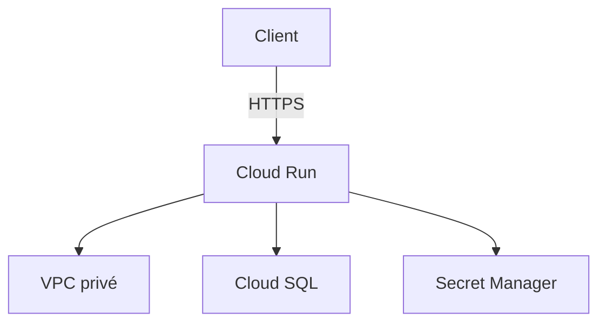
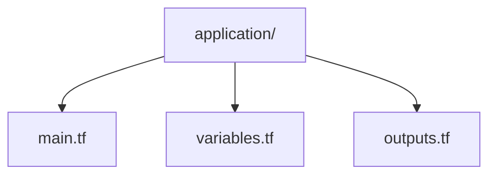
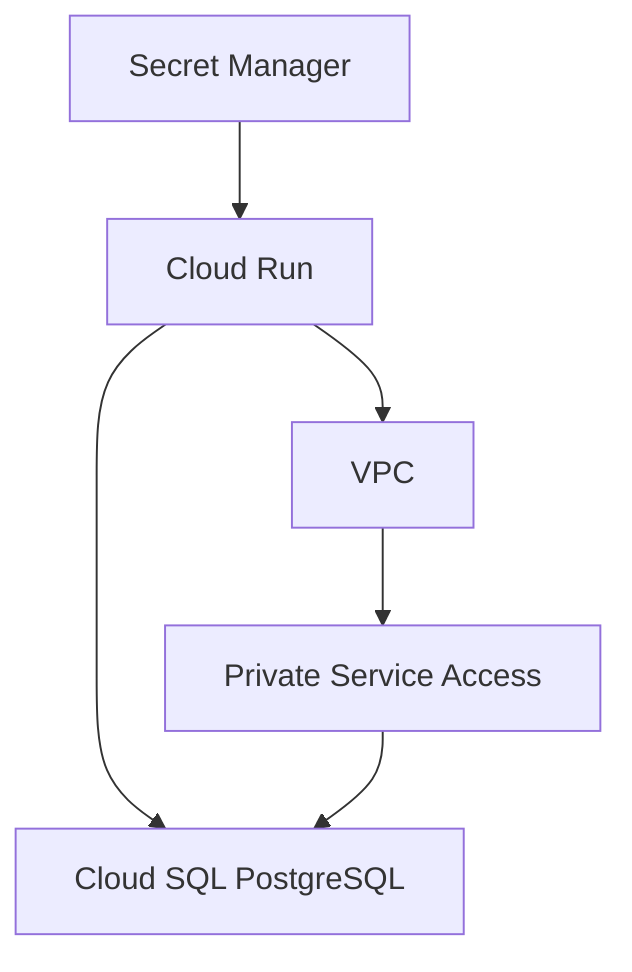

# Module Application

Le module `application` gère le déploiement de l'application MediRDV sur Google Cloud.

## Objectif

L'application est déployée avec **Cloud Run** et utilise une identité dédiée afin de limiter les permissions disponibles.





Le fichier [`main.tf`](./main.tf) permet de configurer :

- le **Service Account** dédié à Cloud Run ;
- les **permissions** associées à ce Service Account.
- le service Cloud Run ;
- l'image Docker de l'application ;
- les variables d'environnement ;
- l'accès au VPC ;
- l'accès au secret contenant le mot de passe PostgreSQL ;
- l'accès public au service Cloud Run.
- Identité dédiée


### Cloud Run utilise un Service Account spécifique :

```
medirdv-cloud-run
```

>Note: Cela permet de ne pas utiliser une identité disposant de permissions excessives.

### Le Service Account possède notamment le rôle :

```
roles/secretmanager.secretAccessor
```

>Note: Ce rôle permet à l'application de récupérer le secret nécessaire à la connexion à PostgreSQL.

## Connexion à la base
### Cloud Run reçoit les informations nécessaires à la connexion PostgreSQL :

```DB_HOST
DB_NAME
DB_USER
DB_PASSWORD
```
> Note: Le mot de passe n'est pas directement écrit dans Terraform.

Il est récupéré depuis :


>Note: La base de données utilise uniquement une adresse IP privée.


Le fichier [variables.tf](./variables.tf) définit les paramètres nécessaires au déploiement de l'application :

- project_id : projet Google Cloud ;

- region : région Cloud Run ;

- cloud_run_name : nom du service ;

- container_image : image Docker ;

- network_id : VPC utilisé ;

- subnet_id : subnet utilisé ;

- database_host : adresse IP privée de Cloud SQL ;

- database_name : nom de la base ;

- database_user : utilisateur PostgreSQL ;

- database_secret : secret contenant le mot de passe.

le module [outputs.tf](./outputs.tf) retourne notament :

- URL Cloud Run
- Service Account Cloud Run

>Note: Ces informations peuvent ensuite être utilisées par le module principal Terraform.

## Sécurité
### le module applique plusieurs principes de sécurité :
- identité dédiée pour Cloud Run ;
- permissions minimales ;
- secrets stockés dans Secret Manager ;
- connexion privée à Cloud SQL ;
- aucune gestion du mot de passe directement dans l'application ;
- accès réseau contrôlé par le VPC.

## Déploiement
### Le module n'est pas déployé directement.

- Il est appelé depuis le main.tf situé à la racine du projet grace a :
```
module "application" {
  source = "./modules/application"

  project_id      = var.project_id
  region          = var.region
  cloud_run_name  = var.cloud_run_name
  container_image = var.container_image

  network_id = module.network.network_id
  subnet_id  = module.network.subnet_id

  database_host   = module.database.private_ip
  database_name   = module.database.database_name
  database_user   = module.database.database_user
  database_secret = module.database.password_secret
}
```

## Le déploiement global se fait ensuite avec :
```
terraform plan
terraform apply
```