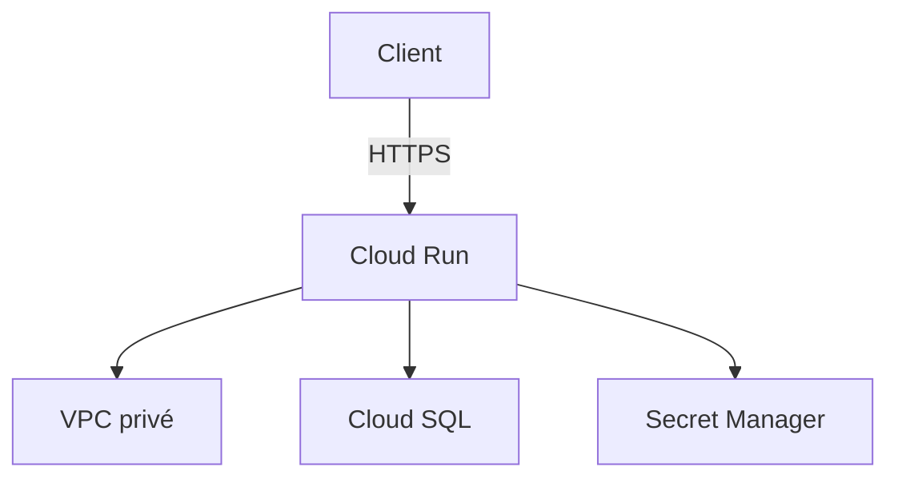
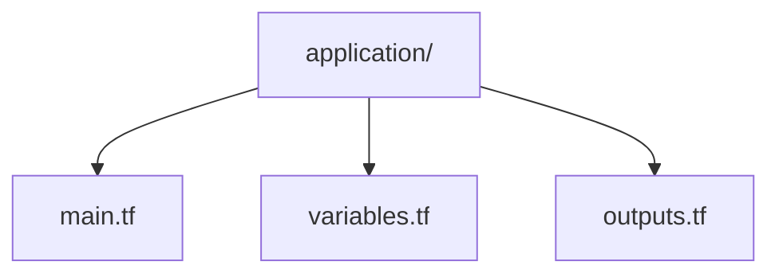
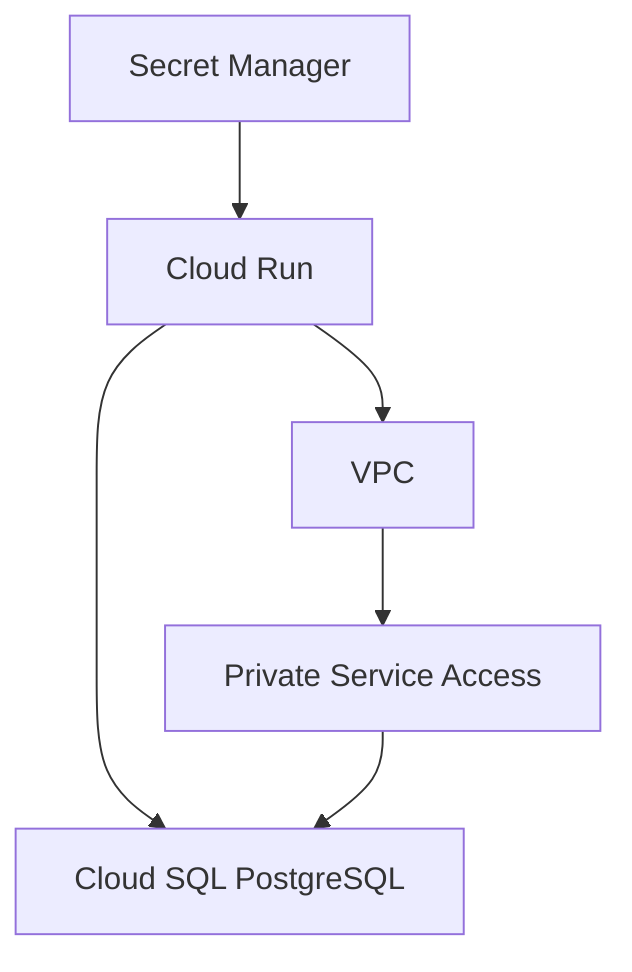

# Module Application

Le module `application` gère le déploiement de l'application MediRDV sur Google Cloud.

## Objectif

L'application est déployée avec **Cloud Run** et utilise un compte de service dédié afin de limiter les permissions accordées à l'application.





## Configuration du module

Le fichier [`main.tf`](./main.tf) permet de configurer :

- le compte de service dédié à Cloud Run ;
- les permissions IAM associées à ce compte de service ;
- le service Cloud Run ;
- l'image Docker de l'application ;
- les variables d'environnement ;
- l'accès au VPC et au sous-réseau ;
- l'accès au secret contenant le mot de passe PostgreSQL ;
- l'accès public au service Cloud Run.

## Identité dédiée

Cloud Run utilise un compte de service spécifique :

```bash
medirdv-cloud-run
```

Ce compte de service permet de distinguer l'identité de l'application des autres identités du projet Google Cloud.

Le compte de service possède notamment les rôles suivants :

- `roles/secretmanager.secretAccessor` : permet de récupérer le secret contenant le mot de passe PostgreSQL ;
- `roles/cloudsql.client` : autorise l'utilisation des fonctionnalités clientes de Cloud SQL ;
- `roles/run.viewer` : permet de consulter les informations des services Cloud Run.

Les permissions doivent être limitées aux besoins réels de l'application, conformément au principe du moindre privilège.

## Connexion à la base de données

Cloud Run reçoit les informations nécessaires à la connexion PostgreSQL à travers les variables d'environnement suivantes :

```hcl
DB_HOST
INSTANCE_CONNECTION_NAME
DB_NAME
DB_USER
DB_PASSWORD
```

Le mot de passe n'est pas directement écrit dans le code Terraform. Il est récupéré depuis **Secret Manager**, à l'aide de la référence au secret configurée dans `main.tf`.



Le module configure les interfaces réseau de Cloud Run pour utiliser le VPC et le sous-réseau indiqués.

L'adresse de la base de données est fournie par la variable `database_host`, décrite comme une adresse IP privée de Cloud SQL.

La configuration de l'instance Cloud SQL et de Private Service Access relève des ressources ou modules correspondants du projet et n'est pas définie directement dans les trois fichiers de ce module.

## Variables Terraform

Le fichier [`variables.tf`](./variables.tf) définit les paramètres nécessaires au déploiement de l'application :

- `project_id` : identifiant du projet Google Cloud ;
- `region` : région de déploiement de Cloud Run ;
- `cloud_run_name` : nom du service Cloud Run ;
- `container_image` : image Docker de l'application ;
- `network_id` : identifiant du VPC utilisé ;
- `subnet_id` : identifiant du sous-réseau utilisé ;
- `database_host` : adresse IP privée de Cloud SQL ;
- `database_name` : nom de la base de données PostgreSQL ;
- `database_user` : utilisateur PostgreSQL ;
- `database_secret` : nom du secret contenant le mot de passe PostgreSQL ;
- `instance_connection_name` : nom de connexion de l'instance Cloud SQL.

## Outputs

Le fichier [`outputs.tf`](./outputs.tf) expose les informations suivantes après le déploiement :

- `url` : URL du service Cloud Run ;
- `service_account` : adresse e-mail du compte de service Cloud Run.

Ces informations peuvent ensuite être utilisées par le module principal Terraform ou consultées à l'aide des commandes Terraform appropriées.

## Sécurité

Le module met en œuvre plusieurs mécanismes de sécurité :

- utilisation d'un compte de service dédié à Cloud Run ;
- attribution de rôles IAM spécifiques à ce compte ;
- stockage du mot de passe PostgreSQL dans Secret Manager ;
- utilisation du VPC et du sous-réseau configurés pour le service ;
- transmission du mot de passe à Cloud Run via une référence à Secret Manager ;
- configuration de l'accès public au service Cloud Run avec le rôle `roles/run.invoker` attribué à `allUsers`.

L'accès public au niveau IAM autorise l'invocation du service. L'authentification éventuellement mise en œuvre directement dans l'application reste indépendante de cette configuration.

## Déploiement

### Appel du module

Le module `application` n'est pas déployé indépendamment. Il est appelé depuis le fichier [`main.tf`](./main.tf) situé à la racine du projet.

Exemple d'appel :

```hcl
module "application" {
  source = "./modules/application"

  project_id      = var.project_id
  region          = var.region
  cloud_run_name  = var.cloud_run_name
  container_image = var.container_image

  network_id = module.network.network_id
  subnet_id  = module.network.subnet_id

  database_host            = module.database.private_ip
  database_name            = module.database.database_name
  database_user            = module.database.database_user
  database_secret          = module.database.password_secret
  instance_connection_name = module.database.instance_connection_name
}
```

Les valeurs transmises au module doivent correspondre aux variables et aux outputs réellement définis dans les autres modules du projet. En particulier, `module.database.instance_connection_name` doit exister dans le module de base de données pour que cet exemple fonctionne tel quel.

### Commandes de déploiement

Depuis le répertoire racine du projet, après avoir configuré les variables et initialisé Terraform :

```bash
terraform init
```

```bash
terraform plan
```

```bash
terraform apply
```

La commande `terraform plan` permet de prévisualiser les modifications prévues. La commande `terraform apply` permet ensuite de les appliquer.

À vérifier avant de valider : l'output `instance_connection_name` doit bien exister dans ton module `database`. Si tu m'envoies son code, je pourrai confirmer que l'exemple d'appel est exact.