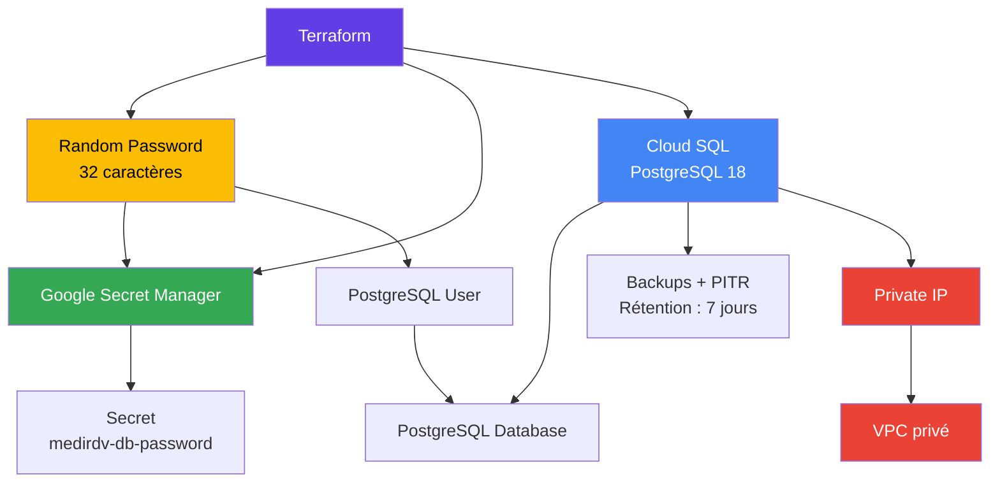
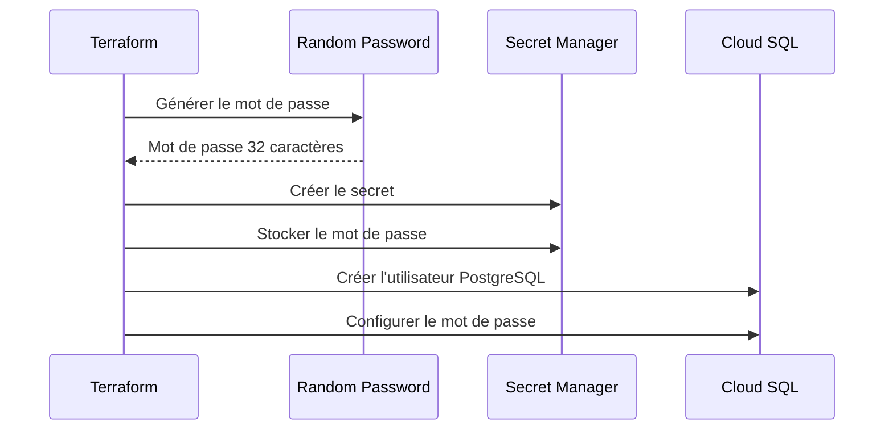
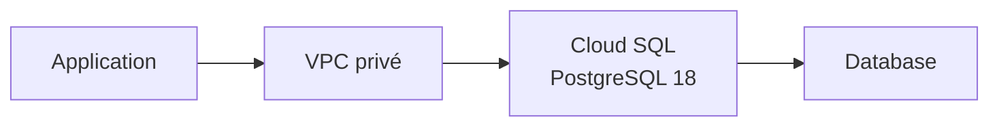
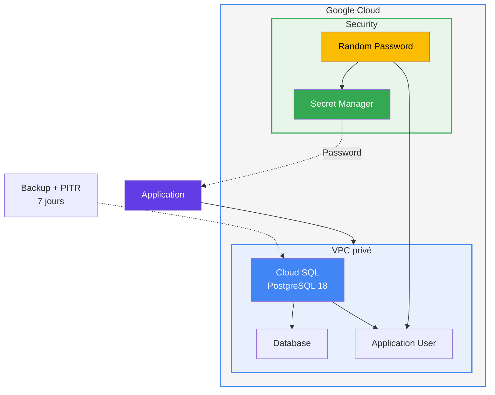

# Module Database

Ce module `database` Terraform permet de déployer une instance PostgreSQL 18 sur Google Cloud SQL, avec une connexion privée via un VPC, la gestion automatique du mot de passe via Google Secret Manager, ainsi que les sauvegardes et le Point-in-Time Recovery (PITR).

## Architecture

## Ressources créées
#### Le module crée les ressources suivantes :

| Ressource | Description |
|---|---|
| `random_password.database` | Génère un mot de passe aléatoire de 32 caractères |
| `google_secret_manager_secret.database_password` | Crée le secret dans Google Secret Manager |
| `google_secret_manager_secret_version.database_password` | Stocke le mot de passe dans le secret |
| `google_sql_database_instance.postgres` | Crée l’instance Cloud SQL PostgreSQL |
| `google_sql_database.database` | Crée la base de données PostgreSQL |
| `google_sql_user.application` | Crée l’utilisateur PostgreSQL |

### Fichiers
.
├── [`main.tf`](./main.tf)
├── [`variables.tf`](./variables.tf)
└── [`outputs.tf`](./outputs.tf)

[`main.tf`](./main.tf)
Ce fichier contient l'ensemble des ressources nécessaires au déploiement de PostgreSQL.

L'instance Cloud SQL est configurée avec :
- PostgreSQL 18 ;
- le tier db-f1-micro ;
- une adresse IP publique désactivée ;
- une adresse IP privée ;
- un VPC existant ;
- les sauvegardes automatiques activées ;
- le Point-in-Time Recovery activé ;
- une rétention des journaux de transactions de 7 jours.


[`variables.tf`](./variables.tf)
Ce fichier définit les variables utilisées par le module.


| Variable | Type | Description |
|---|---|---|
| `project_id` | `string` | ID du projet Google Cloud |
| `region` | `string` | Région Cloud SQL |
| `network_id` | `string` | ID du VPC privé |
| `database_name` | `string` | Nom de la base PostgreSQL |
| `database_user` | `string` | Nom de l'utilisateur PostgreSQL |


[`outputs.tf`](./outputs.tf)
Ce fichier expose les informations utiles après le déploiement.

| Output | Description |
|---|---|
| `instance_name` | Nom de l'instance Cloud SQL |
| `private_ip` | Adresse IP privée de l'instance |
| `database_name` | Nom de la base de données |
| `database_user` | Nom de l'utilisateur PostgreSQL |
| `password_secret` | Nom du secret contenant le mot de passe |


## Prérequis

Avant d'utiliser ce module, vous devez disposer de :

- Terraform installé ;
- un projet Google Cloud ;
- un VPC existant ;
- les permissions nécessaires pour créer des ressources Cloud SQL ;
- les permissions nécessaires pour utiliser Secret Manager.
- Les APIs Google Cloud suivantes doivent être activées :

> Note: Le project necessite egalement l activation des api suivante 
- Cloud SQL Admin API ;
- Secret Manager API ;
- Compute Engine API.

## variables
Les variables peuvent être renseignées dans un fichier terraform.tfvars.

Exemple :
```
project_id    = "mon-projet-gcp"
region        = "europe-west1"
network_id    = "projects/mon-projet-gcp/global/networks/mon-vpc"
database_name = "medirdv"
database_user = "medirdv-app"
```

| Paramètre | Description |
|---|---|
| `project_id` | Projet Google Cloud dans lequel les ressources seront créées |
| `region` | Région de l’instance Cloud SQL |
| `network_id` | VPC utilisé pour la connexion privée à Cloud SQL |
| `database_name` | Nom de la base PostgreSQL |
| `database_user` | Utilisateur PostgreSQL utilisé par l'application |


## Déploiement
1. Initialiser Terraform
```
terraform init
```
2. Vérifier la configuration
```
terraform validate
```
3. Générer le plan Terraform
```
terraform plan
```
4. Déployer l'infrastructure
```
terraform apply
```

Pour appliquer automatiquement sans confirmation :
```
terraform apply -auto-approve
```

## Outputs
Une fois le déploiement terminé, les outputs peuvent être affichés avec :
```
terraform output
```
Pour récupérer uniquement le nom de l'instance :
```
terraform output instance_name
```
Pour récupérer l'adresse IP privée :
```
terraform output private_ip
```
Pour récupérer le nom de la base :
```
terraform output database_name
```
Pour récupérer l'utilisateur :
```
terraform output database_user
```
Pour récupérer le nom du secret :
```
terraform output password_secret
```

## Gestion du mot de passe
Le mot de passe PostgreSQL est généré automatiquement par Terraform.
```
resource "random_password" "database" {
  length  = 32
  special = true
}
```

### Le mot de passe généré est ensuite :

- utilisé pour créer l'utilisateur PostgreSQL ;
- enregistré dans Google Secret Manager ;
- accessible via le secret medirdv-db-password.


### Récupérer le mot de passe
Le mot de passe peut être récupéré depuis Google Secret Manager avec :
```
gcloud secrets versions access latest \
  --secret="medirdv-db-password"
```
> Attention : le mot de passe ne doit pas être ajouté dans Git ou dans un fichier terraform.tfvars versionné.
Configuration Cloud SQL

## L'instance utilise la configuration suivante :

| Configuration | Valeur |
|---|---|
| **Moteur** | PostgreSQL |
| **Version** | PostgreSQL 18 |
| **Tier** | `db-f1-micro` |
| **IP publique** | Désactivée |
| **IP privée** | Activée |
| **VPC** | VPC fourni par `network_id` |
| **Backup** | Activé |
| **PITR** | Activé |
| **Rétention transactionnelle** | 7 jours |

## Réseau
L'instance Cloud SQL n'est pas accessible directement depuis Internet.

La configuration suivante désactive l'adresse IPv4 publique :
```
ip_configuration {
  ipv4_enabled    = false
  private_network = var.network_id
}
```

L'accès à PostgreSQL doit donc être effectué depuis une ressource ayant accès au VPC privé.

Par exemple :

## Sauvegardes et récupération
### Les sauvegardes sont activées :
```
backup_configuration {
  enabled                        = true
  point_in_time_recovery_enabled = true
  transaction_log_retention_days = 7
}
```
La configuration permet :
- des sauvegardes automatiques ;
- la récupération à un instant précis ;
- la conservation des journaux de transactions pendant 7 jours.

### Sécurité
Le module applique plusieurs mesures de sécurité :

- accès public à Cloud SQL désactivé ;
- connexion via IP privée ;
- mot de passe généré automatiquement ;
- mot de passe stocké dans Secret Manager ;
- sauvegardes activées ;
- PITR activé.

### Bonnes pratiques
Il est recommandé de :
- ne jamais stocker le mot de passe en clair dans Git ;
- ne jamais mettre le mot de passe directement dans terraform.tfvars ;
- limiter les permissions IAM sur Secret Manager ;
- utiliser un VPC privé ;
- activer la protection contre la suppression en production.
- Protection contre la suppression

La configuration actuelle contient :
```
deletion_protection = false
```
> Cela signifie que l'instance peut être supprimée par Terraform.

Pour un environnement de production, il est recommandé d'utiliser :
```
deletion_protection = true
```
> Cela permet d'éviter une suppression accidentelle de l'instance Cloud SQL.

## Suppression
### Pour supprimer les ressources :
```
terraform destroy
Terraform demandera une confirmation.
```
### Pour supprimer automatiquement :
```
terraform destroy -auto-approve
```
>Attention : la suppression de l'instance Cloud SQL peut entraîner une perte de données. Vérifiez toujours les sauvegardes avant de supprimer une base de données.

Structure finale
├── main.tf
├── variables.tf
├── outputs.tf
└── README.md

# Résumé
Ce module Terraform permet de déployer une base PostgreSQL managée sur Google Cloud avec une architecture privée et sécurisée.
