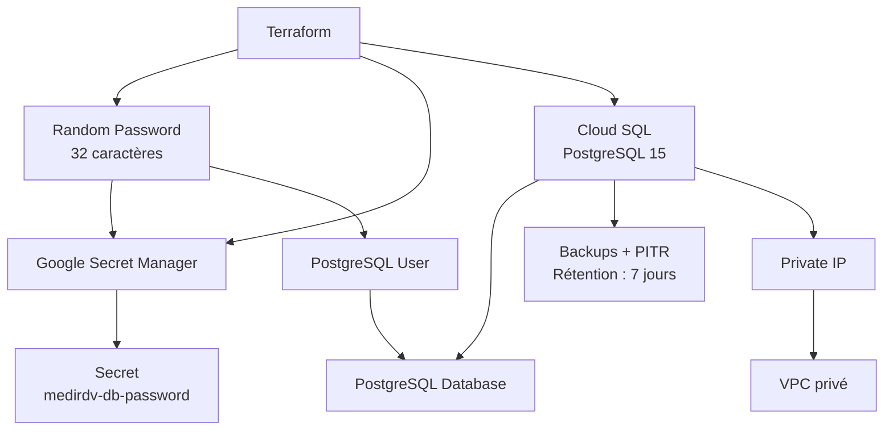
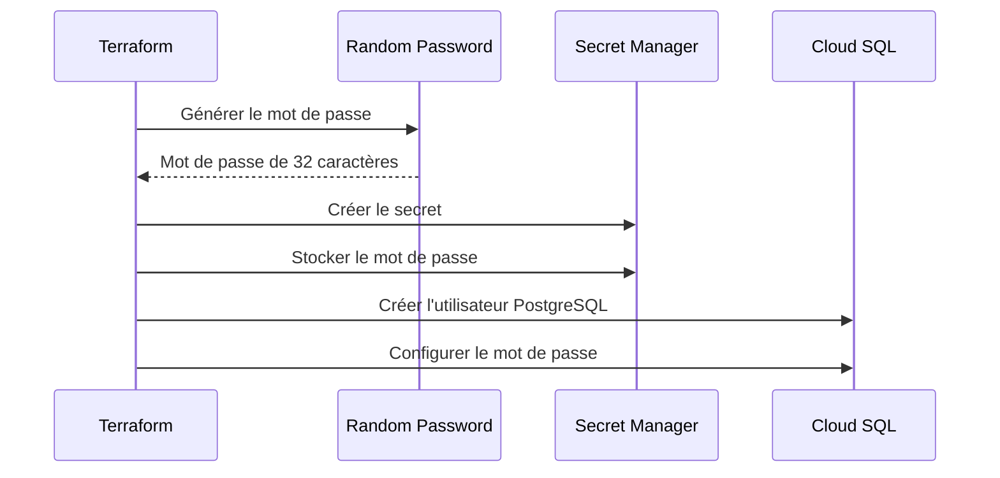
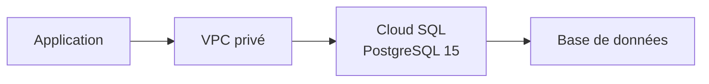

# Module Database

Le module `database` permet de déployer une instance PostgreSQL 15 sur Google Cloud SQL avec une connexion privée via un VPC, la génération automatique du mot de passe et son stockage dans Google Secret Manager, ainsi que les sauvegardes et la récupération à un instant précis (Point-in-Time Recovery ou PITR).

## Architecture



## Ressources créées

Le module crée les ressources suivantes :

| Ressource | Description |
| --- | --- |
| `random_password.database` | Génère un mot de passe aléatoire de 32 caractères |
| `google_secret_manager_secret.database_password` | Crée le secret dans Google Secret Manager |
| `google_secret_manager_secret_version.database_password` | Enregistre le mot de passe dans le secret |
| `google_sql_database_instance.postgres` | Crée l'instance Cloud SQL PostgreSQL |
| `google_sql_database.database` | Crée la base de données PostgreSQL |
| `google_sql_user.application` | Crée l'utilisateur PostgreSQL |

## Structure des fichiers
```
database/
├── main.tf
├── variables.tf
├── outputs.tf
└── README.md
```

### `main.tf`

Le fichier [`main.tf`](./main.tf)  contient les ressources nécessaires au déploiement de PostgreSQL.

L'instance Cloud SQL est configurée avec :

- PostgreSQL 15 ;
- le tier `db-custom-1-3840` ;
- une adresse IPv4 publique désactivée ;
- une adresse IP privée via le VPC fourni ;
- les sauvegardes activées ;
- le Point-in-Time Recovery (PITR) activé ;
- une rétention des journaux de transactions de 7 jours ;
- la protection contre la suppression désactivée.

### `variables.tf`

Le fichier [`variables.tf`](./variables.tf) définit les paramètres nécessaires au déploiement.

| Variable | Type | Description |
| --- | --- | --- |
| `project_id` | `string` | Identifiant du projet Google Cloud |
| `region` | `string` | Région Cloud SQL |
| `network_id` | `string` | Identifiant du VPC utilisé par Cloud SQL |
| `database_name` | `string` | Nom de la base PostgreSQL |
| `database_user` | `string` | Nom de l'utilisateur PostgreSQL |

### `outputs.tf`

Le fichier [`outputs.tf`](./outputs.tf) expose les informations utiles après le déploiement.

| Output | Description |
| --- | --- |
| `instance_name` | Nom de l'instance Cloud SQL |
| `private_ip` | Adresse IP privée de l'instance |
| `database_name` | Nom de la base de données |
| `database_user` | Nom de l'utilisateur PostgreSQL |
| `password_secret` | Identifiant du secret contenant le mot de passe |
| `instance_connection_name` | Nom de connexion de l'instance Cloud SQL |

## Prérequis

Avant d'utiliser ce module, vous devez disposer de :

- Terraform installé ;
- un projet Google Cloud ;
- un VPC existant ;
- les permissions nécessaires pour créer et configurer les ressources Cloud SQL ;
- les permissions nécessaires pour utiliser Google Secret Manager ;
- les API Google Cloud requises activées.

Les API à vérifier comprennent notamment :

- Cloud SQL Admin API ;
- Secret Manager API ;
- Compute Engine API.

La connectivité privée nécessite également une configuration réseau compatible avec Cloud SQL, notamment Private Service Access si cette méthode est utilisée. Cette configuration n'est pas créée directement par le module `database`.

## Variables de configuration

Les variables peuvent être renseignées dans un fichier `terraform.tfvars`.

Exemple :

```hcl
project_id    = "mon-projet-gcp"
region        = "europe-west1"
network_id    = "projects/mon-projet-gcp/global/networks/mon-vpc"
database_name = "medirdv"
database_user = "medirdv-app"
```

Les valeurs doivent être adaptées à votre projet Google Cloud et à votre infrastructure réseau.

| Paramètre | Description |
| --- | --- |
| `project_id` | Projet Google Cloud dans lequel les ressources seront créées |
| `region` | Région de l'instance Cloud SQL |
| `network_id` | VPC utilisé pour la connexion privée à Cloud SQL |
| `database_name` | Nom de la base PostgreSQL |
| `database_user` | Utilisateur PostgreSQL utilisé par l'application |

## Déploiement

Depuis le répertoire contenant la configuration Terraform du module :

### 1. Initialiser Terraform

```bash
terraform init
```

### 2. Vérifier la configuration

```bash
terraform validate
```

### 3. Générer le plan Terraform

```bash
terraform plan
```

### 4. Déployer l'infrastructure

```bash
terraform apply
```

Pour appliquer automatiquement les modifications sans demander de confirmation :

```bash
terraform apply -auto-approve
```

>L'option `-auto-approve` doit être utilisée avec précaution, particulièrement dans un environnement de production.

## Outputs Terraform

Une fois le déploiement terminé, les outputs peuvent être affichés avec :

```bash
terraform output
```

Pour récupérer uniquement le nom de l'instance :

```bash
terraform output instance_name
```

Pour récupérer l'adresse IP privée :

```bash
terraform output private_ip
```

Pour récupérer le nom de la base de données :

```bash
terraform output database_name
```

Pour récupérer l'utilisateur PostgreSQL :

```bash
terraform output database_user
```

Pour récupérer le nom du secret :

```bash
terraform output password_secret
```

Pour récupérer le nom de connexion de l'instance :

```bash
terraform output instance_connection_name
```

## Gestion du mot de passe

Le mot de passe PostgreSQL est généré automatiquement par Terraform :

```hcl
resource "random_password" "database" {
  length  = 32
  special = true
}
```

Le mot de passe généré est ensuite :

- utilisé pour créer l'utilisateur PostgreSQL ;
- enregistré dans Google Secret Manager ;
- associé au secret `medirdv-db-password`.

Le module utilise une ressource `google_secret_manager_secret` avec une réplication automatique et crée une version du secret contenant le mot de passe.

### Flux de création du mot de passe



### Récupérer le mot de passe

Le mot de passe peut être récupéré depuis Google Secret Manager avec la commande suivante :

```bash
gcloud secrets versions access latest \
  --secret="medirdv-db-password" \
  --project="mon-projet-gcp"
```

Remplacez `mon-projet-gcp` par l'identifiant réel du projet.

>Attention : le mot de passe ne doit pas être ajouté dans Git ni dans un fichier `terraform.tfvars` versionné. L'accès au secret doit être limité aux identités qui en ont besoin.

## Configuration Cloud SQL

L'instance utilise la configuration suivante :

| Configuration | Valeur |
| --- | --- |
| Moteur | PostgreSQL |
| Version | PostgreSQL 15 |
| Tier | `db-custom-1-3840` |
| IP publique | Désactivée |
| IP privée | Configurée via le VPC fourni |
| Sauvegardes | Activées |
| PITR | Activé |
| Rétention des journaux de transactions | 7 jours |
| Protection contre la suppression | Désactivée |

## Réseau

L'instance Cloud SQL est configurée sans adresse IPv4 publique.

La configuration correspondante dans `main.tf` est :

```hcl
ip_configuration {
  ipv4_enabled    = false
  private_network = var.network_id
}
```

Le paramètre `private_network` associe l'instance au VPC fourni par la variable `network_id`.

L'accès à PostgreSQL doit donc être effectué depuis une ressource disposant d'une connectivité vers le réseau privé.

Exemple de représentation de l'architecture :



La configuration du VPC et de Private Service Access doit être assurée par les ressources réseau appropriées. Elle n'est pas créée par les trois fichiers de ce module.

## Sauvegardes et récupération

Les sauvegardes et le PITR sont configurés avec le bloc suivant :

```hcl
backup_configuration {
  enabled                        = true
  point_in_time_recovery_enabled = true
  transaction_log_retention_days = 7
}
```

Cette configuration active :

- les sauvegardes automatiques ;
- la récupération à un instant précis, selon les capacités et les limites de Cloud SQL ;
- la conservation des journaux de transactions pendant 7 jours.

Ces mécanismes contribuent à la récupération des données en cas d'incident. Ils ne remplacent pas une procédure de restauration testée.

## Sécurité

Le module met en œuvre plusieurs mesures de sécurité :

- désactivation de l'adresse IPv4 publique ;
- utilisation d'une adresse IP privée via le VPC ;
- génération automatique du mot de passe PostgreSQL ;
- stockage du mot de passe dans Google Secret Manager ;
- activation des sauvegardes ;
- activation du PITR.

### Bonnes pratiques

Il est recommandé de :

- ne jamais stocker le mot de passe en clair dans Git ;
- ne jamais versionner un fichier contenant des secrets ;
- limiter les permissions IAM sur Secret Manager ;
- limiter l'accès au VPC aux ressources autorisées ;
- activer la protection contre la suppression en production ;
- tester régulièrement les procédures de restauration.

### Protection contre la suppression

La configuration actuelle contient :

```hcl
deletion_protection = false
```

Cela signifie que la protection Cloud SQL contre la suppression est désactivée dans cette configuration.

Pour un environnement de production, il est recommandé d'étudier l'activation de cette protection :

```hcl
deletion_protection = true
```

Cela contribue à éviter la suppression accidentelle de l'instance. La protection doit être configurée et gérée en tenant compte du cycle de vie Terraform et des procédures de maintenance.

## Suppression

Pour supprimer les ressources gérées par la configuration Terraform :

```bash
terraform destroy
```

Terraform demandera une confirmation avant de poursuivre.

Pour supprimer automatiquement sans confirmation :


```bash
terraform destroy -auto-approve
```

>Attention : la suppression de l'instance Cloud SQL peut entraîner une perte de données. Vérifiez les sauvegardes et les besoins de conservation avant toute suppression.

## Structure finale


```
database/
├── main.tf
├── variables.tf
├── outputs.tf
└── README.md
```

## Résumé

Ce module Terraform déploie une base PostgreSQL managée sur Google Cloud SQL avec :

- une instance PostgreSQL 15 ;
- une base de données et un utilisateur dédiés ;
- un mot de passe généré automatiquement ;
- un secret stocké dans Google Secret Manager ;
- une configuration réseau utilisant une IP privée ;
- des sauvegardes automatiques et le PITR avec une rétention des journaux de transactions de 7 jours.

La configuration du réseau privé doit être assurée par les ressources réseau appropriées du projet. La protection contre la suppression est désactivée dans la configuration actuelle et doit être réévaluée pour la production.

