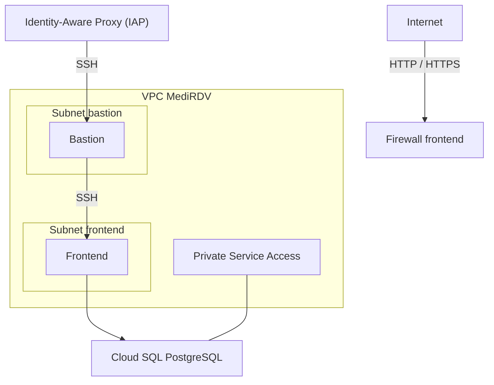
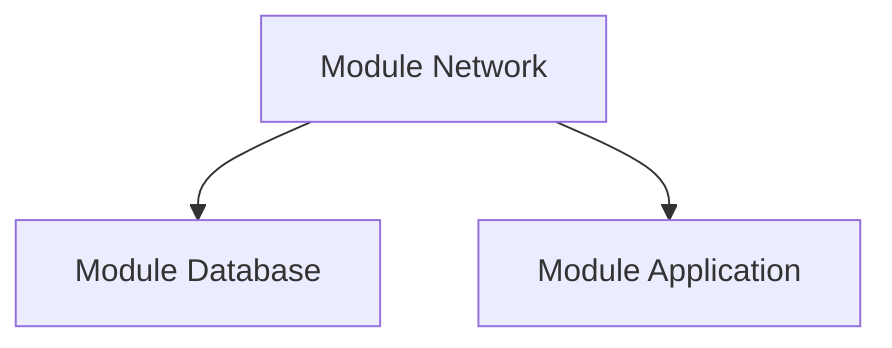

# Module Network

Le module `network` gère le réseau Google Cloud utilisé par l'infrastructure MediRDV.

## Objectif

Créer un VPC personnalisé comprenant deux sous-réseaux dédiés au bastion et au frontend, configurer les règles de pare-feu et préparer la connectivité privée avec les services Google Cloud, notamment Cloud SQL.

## Architecture



Le diagramme représente l'architecture visée. Les ressources Compute Engine portant les tags `bastion` et `frontend`, ainsi que l'instance Cloud SQL, sont gérées par les ressources ou modules correspondants du projet.

## Structure des fichiers

```text
network/
├── main.tf
├── variables.tf
├── outputs.tf
└── README.md
```

## `main.tf`

Le fichier [`main.tf`](./main.tf) configure les ressources réseau suivantes :

- un VPC personnalisé ;
- un sous-réseau pour le bastion ;
- un sous-réseau pour le frontend ;
- une plage d'adresses IP réservée à Private Service Access ;
- une connexion de peering avec `servicenetworking.googleapis.com` ;
- trois règles de pare-feu pour contrôler les flux réseau entrants.

## VPC

Le module crée un VPC personnalisé avec les paramètres suivants :

```hcl
resource "google_compute_network" "vpc" {
  project                 = var.project_id
  name                    = var.network_name
  auto_create_subnetworks = false
  routing_mode            = "REGIONAL"
  mtu                     = 1460
}
```

Le VPC est créé sans sous-réseaux automatiques. Les sous-réseaux sont définis explicitement afin de maîtriser l'adressage réseau.

| Paramètre | Valeur |
|---|---|
| Création automatique des sous-réseaux | Désactivée |
| Mode de routage | `REGIONAL` |
| MTU | `1460` |

Le nom du VPC est fourni par la variable `network_name`.

## Sous-réseaux

Le module crée deux sous-réseaux dans la région indiquée par `var.region`.

### Sous-réseau bastion

Le sous-réseau bastion est destiné aux ressources utilisées pour l'administration de l'infrastructure.

Ses paramètres sont définis par :

- `subnet_bastion_name` : nom du sous-réseau ;
- `subnet_bastion_cidr` : plage d'adresses IP du sous-réseau.

### Sous-réseau frontend

Le sous-réseau frontend est destiné aux ressources frontend de l'infrastructure.

Ses paramètres sont définis par :

- `subnet_frontend_name` : nom du sous-réseau ;
- `subnet_frontend_cidr` : plage d'adresses IP du sous-réseau.

### Accès privé aux services Google

Les deux sous-réseaux utilisent le paramètre suivant :

```hcl
private_ip_google_access = true
```

Ce paramètre permet aux ressources disposant uniquement d'adresses IP privées d'accéder aux services Google pris en charge, sous réserve du routage et des règles réseau nécessaires.

Les plages CIDR exactes sont fournies par les variables Terraform. Elles ne sont pas fixées dans ce module.

## Private Service Access

Le module prépare la connectivité privée avec les services Google en réservant une plage d'adresses IP et en créant une connexion de peering avec le service de réseau Google.

La plage réservée est configurée avec les paramètres suivants :

```hcl
resource "google_compute_global_address" "private_service_range" {
  project       = var.project_id
  name          = "medirdv-private-service-range"
  purpose       = "VPC_PEERING"
  address_type  = "INTERNAL"
  prefix_length = 16
  network       = google_compute_network.vpc.id
}
```

La connexion Private Service Access est créée avec :

```hcl
resource "google_service_networking_connection" "private_service_access" {
  network = google_compute_network.vpc.id
  service = "servicenetworking.googleapis.com"

  reserved_peering_ranges = [
    google_compute_global_address.private_service_range.name
  ]
}
```

Cette configuration permet de préparer l'accès privé aux services Google qui prennent en charge cette méthode, notamment Cloud SQL.

L'instance Cloud SQL doit également être configurée pour utiliser le VPC approprié. La création et la configuration de l'instance de base de données relèvent du module `database`.

## Règles de pare-feu

Le module crée trois règles de pare-feu entrantes.

### SSH vers le bastion via IAP

La règle `allow-iap-ssh-bastion` autorise les connexions SSH sur le port TCP `22` depuis la plage IP utilisée par Identity-Aware Proxy :

```text
35.235.240.0/20
```

La règle cible les ressources portant le tag réseau `bastion`.

Cette configuration permet l'accès SSH via IAP lorsque les ressources concernées, les permissions IAM et les autres prérequis sont correctement configurés.

### HTTP et HTTPS vers le frontend

La règle `allow-internet-to-frontend` autorise le trafic entrant sur les ports TCP `80` et `443` depuis Internet :

```text
0.0.0.0/0
```

Elle cible les ressources portant le tag réseau `frontend`.

Les ressources qui portent ce tag et possèdent une connectivité externe appropriée peuvent donc recevoir du trafic HTTP et HTTPS. Cette règle ne crée pas elle-même de machine virtuelle, d'adresse IP publique, de load balancer ou de service frontend.

### SSH du bastion vers le frontend

La règle `allow-ssh-bastion-to-frontend` autorise les connexions SSH sur le port TCP `22` provenant de ressources portant le tag `bastion` et ciblant les ressources portant le tag `frontend`.

Cette règle facilite l'administration des ressources frontend depuis le bastion, sous réserve du routage et des autres contrôles réseau.

### Récapitulatif des règles

| Règle | Source | Ports | Cible |
|---|---|---|---|
| `allow-iap-ssh-bastion` | `35.235.240.0/20` | TCP `22` | `bastion` |
| `allow-internet-to-frontend` | `0.0.0.0/0` | TCP `80`, `443` | `frontend` |
| `allow-ssh-bastion-to-frontend` | Tag `bastion` | TCP `22` | `frontend` |

Ces règles autorisent les flux indiqués. Elles ne garantissent pas à elles seules que les services concernés soient accessibles : les tags réseau, les adresses IP, les routes et les permissions doivent également être configurés correctement.

## `variables.tf`

Le fichier [`variables.tf`](./variables.tf) définit les paramètres nécessaires à la création du réseau.

| Variable | Type | Description |
|---|---|---|
| `project_id` | `string` | Identifiant du projet Google Cloud |
| `region` | `string` | Région des sous-réseaux |
| `network_name` | `string` | Nom du VPC |
| `subnet_frontend_name` | `string` | Nom du sous-réseau frontend |
| `subnet_frontend_cidr` | `string` | Plage CIDR du sous-réseau frontend |
| `subnet_bastion_name` | `string` | Nom du sous-réseau bastion |
| `subnet_bastion_cidr` | `string` | Plage CIDR du sous-réseau bastion |

Les noms et les plages CIDR doivent être adaptés à l'adressage réseau du projet. Les deux plages ne doivent pas entrer en conflit avec les autres réseaux utilisés par l'infrastructure.

## `outputs.tf`

Le fichier [`outputs.tf`](./outputs.tf) expose les informations réseau utilisables par les autres modules Terraform.

| Output | Description |
|---|---|
| `network_id` | Identifiant du VPC |
| `network_name` | Nom du VPC |
| `subnet_frontend_id` | Identifiant du sous-réseau frontend |
| `subnet_bastion_id` | Identifiant du sous-réseau bastion |

Ces outputs peuvent être référencés depuis le module racine ou d'autres modules Terraform.

Par exemple :

```hcl
network_id = module.network.network_id
```

Pour sélectionner un sous-réseau, il faut utiliser le nom exact de l'output correspondant :

```hcl
subnet_id = module.network.subnet_frontend_id
```

ou :

```hcl
subnet_id = module.network.subnet_bastion_id
```

Le choix du sous-réseau dépend de la ressource qui en a besoin.

## Exemple de configuration

Les variables peuvent être renseignées dans un fichier `terraform.tfvars` :

```hcl
project_id = "mon-projet-gcp"
region     = "europe-west1"

network_name = "medirdv-vpc"

subnet_bastion_name = "medirdv-subnet-bastion"
subnet_bastion_cidr = "10.10.0.0/24"

subnet_frontend_name = "medirdv-subnet-frontend"
subnet_frontend_cidr = "10.10.1.0/24"
```

Ces valeurs sont des exemples. Les plages CIDR doivent être vérifiées par rapport à l'ensemble de l'infrastructure avant le déploiement.

## Utilisation du module

Le module est appelé depuis le fichier `main.tf` situé à la racine du projet.

Exemple :

```hcl
module "network" {
  source = "./modules/network"

  project_id = var.project_id
  region     = var.region

  network_name = var.network_name

  subnet_bastion_name = var.subnet_bastion_name
  subnet_bastion_cidr = var.subnet_bastion_cidr

  subnet_frontend_name = var.subnet_frontend_name
  subnet_frontend_cidr = var.subnet_frontend_cidr
}
```

Les noms des variables utilisées dans cet exemple doivent correspondre aux variables déclarées dans le module racine.

## Dépendances

Le réseau fournit des ressources nécessaires aux autres composants de l'infrastructure.



Le module `database` utilise le VPC pour configurer l'accès privé à Cloud SQL.

Le module `application` utilise le VPC et un sous-réseau pour configurer la connectivité réseau de Cloud Run.

Les outputs effectivement transmis doivent correspondre à ceux déclarés dans chaque module.

## Prérequis

Avant de déployer ce module, il faut disposer de :

- Terraform installé et initialisé ;
- un projet Google Cloud ;
- les permissions nécessaires pour créer des réseaux, des sous-réseaux, des règles de pare-feu et des connexions de service réseau ;
- les API Google Cloud nécessaires activées.

L'API Compute Engine est notamment nécessaire pour les ressources VPC, sous-réseaux, adresses et pare-feu. La configuration Private Service Access nécessite également les permissions et services Google Cloud correspondants.

## Déploiement

Depuis le répertoire racine du projet Terraform :

### 1. Initialiser Terraform

```bash
terraform init
```

### 2. Vérifier la configuration

```bash
terraform validate
```

### 3. Prévisualiser les modifications

```bash
terraform plan
```

### 4. Déployer l'infrastructure

```bash
terraform apply
```

La commande `terraform plan` permet de vérifier les modifications prévues avant leur application.

La commande `terraform apply` crée ou met à jour les ressources selon la configuration Terraform.

## Sécurité et bonnes pratiques

Le module met en œuvre plusieurs mécanismes de contrôle réseau :

- VPC personnalisé sans sous-réseaux automatiques ;
- sous-réseaux séparés pour le bastion et le frontend ;
- accès SSH au bastion limité à la plage utilisée par IAP ;
- accès SSH au frontend limité aux ressources portant le tag `bastion` ;
- ports HTTP et HTTPS autorisés vers les ressources portant le tag `frontend` ;
- plage d'adresses réservée pour Private Service Access.

Il est recommandé de :

- vérifier les plages CIDR pour éviter les chevauchements ;
- limiter les ressources portant les tags `bastion` et `frontend` aux machines concernées ;
- contrôler les permissions IAM nécessaires à IAP ;
- vérifier les règles de pare-feu supplémentaires présentes dans le projet ;
- examiner l'exposition Internet des ressources frontend ;
- vérifier la configuration Private Service Access et Cloud SQL avant le déploiement en production.

## Résumé

Le module `network` crée l'infrastructure réseau de base de MediRDV sur Google Cloud.

Il comprend :

- un VPC personnalisé ;
- deux sous-réseaux dédiés au bastion et au frontend ;
- une plage IP réservée pour Private Service Access ;
- une connexion de peering avec les services réseau Google ;
- trois règles de pare-feu pour SSH via IAP, HTTP/HTTPS vers le frontend et SSH du bastion vers le frontend ;
- quatre outputs utilisables par les autres modules Terraform.

La création des machines, du service Cloud Run et de l'instance Cloud SQL relève des modules correspondants. Le module réseau prépare leur connectivité, mais ne crée pas lui-même ces services.
