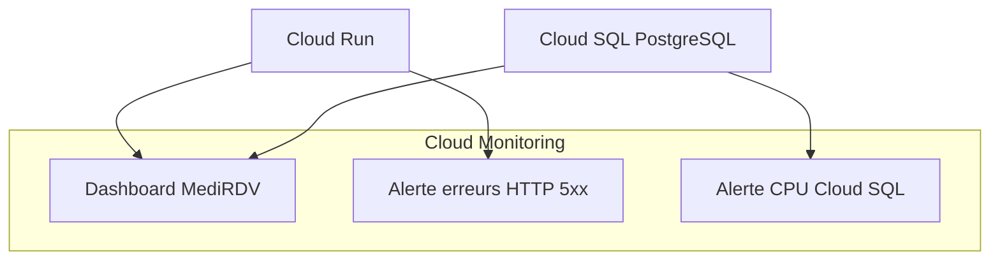

# Module Observability

Le module `observability` permet de superviser l'infrastructure MediRDV sur Google Cloud grâce à Cloud Monitoring.

Il fournit un tableau de bord pour suivre les métriques de Cloud Run et Cloud SQL, ainsi que deux politiques d'alerte permettant de détecter certaines anomalies.

## Objectif

L'objectif du module est de faciliter le suivi de l'état et des performances de l'application et de la base de données.

Le module configure :

- un dashboard Google Cloud Monitoring ;
- des graphiques pour les requêtes, les erreurs et la latence de Cloud Run ;
- des graphiques pour l'utilisation CPU, les connexions et l'utilisation disque de Cloud SQL ;
- une alerte sur les erreurs HTTP 5xx de Cloud Run ;
- une alerte lorsque l'utilisation CPU de Cloud SQL dépasse 80 % pendant une durée définie.

**Remarque :** le code fourni configure Cloud Monitoring. Il ne crée pas de ressource Log Sink et ne configure pas de canal de notification pour les alertes.

## Architecture



Ce diagramme représente les métriques surveillées et les ressources de supervision configurées par le module.

## Structure du module

```text
observability/
├── main.tf
├── alerts.tf
├── variables.tf
├── outputs.tf
└── README.md
```

Les noms de fichiers ci-dessus correspondent à une organisation possible des ressources. Les ressources du dashboard et des alertes peuvent être réparties différemment dans les fichiers Terraform, à condition que la configuration soit cohérente.

## Dashboard Cloud Monitoring

Le dashboard est créé par la ressource Terraform :

```hcl
resource "google_monitoring_dashboard" "medirdv"
```

Son nom d'affichage est :

```text
MediRDV - Dashboard Infrastructure
```

Il utilise une disposition en grille avec deux colonnes et contient six graphiques.

### Métriques Cloud Run

| Graphique | Métrique | Description |
|---|---|---|
| Nombre de requêtes | `run.googleapis.com/request_count` | Suit le débit des requêtes |
| Erreurs | `run.googleapis.com/request_count` | Suit les requêtes dont la classe de code HTTP est `5xx` |
| Latence | `run.googleapis.com/request_latencies` | Suit la latence au 95e percentile |

Les graphiques utilisent un intervalle d'agrégation de 60 secondes.

Le graphique du nombre de requêtes utilise `ALIGN_RATE` et `REDUCE_SUM` afin d'afficher le débit global des requêtes.

Le graphique des erreurs filtre les requêtes dont `metric.label.response_code_class` vaut `5xx`.

Le graphique de latence utilise les alignements `ALIGN_PERCENTILE_95` et `REDUCE_PERCENTILE_95`.

### Métriques Cloud SQL

| Graphique | Métrique | Description |
|---|---|---|
| Utilisation CPU | `cloudsql.googleapis.com/database/cpu/utilization` | Suit l'utilisation du processeur |
| Connexions | `cloudsql.googleapis.com/database/network/connections` | Suit le nombre de connexions |
| Utilisation disque | `cloudsql.googleapis.com/database/disk/bytes_used` | Suit l'espace disque utilisé en octets |

Les graphiques utilisent un intervalle d'agrégation de 60 secondes.

Les graphiques CPU, connexions et disque utilisent `ALIGN_MEAN` et `REDUCE_MEAN`.

Les métriques affichées dépendent de leur disponibilité dans Cloud Monitoring et des ressources Cloud Run et Cloud SQL présentes dans le projet.

## Politiques d'alerte

Le module configure deux politiques d'alerte avec la ressource Terraform :

```hcl
resource "google_monitoring_alert_policy"
```

Les deux politiques sont activées.

### Alerte Cloud Run — erreurs HTTP 5xx

Nom d'affichage :

```text
MediRDV - Cloud Run errors
```

Condition :

- ressource surveillée : `cloud_run_revision` ;
- métrique : `run.googleapis.com/request_count` ;
- filtre : classe de réponse HTTP `5xx` ;
- comparaison : `COMPARISON_GT` ;
- seuil : `0` ;
- durée : `300s`, soit 5 minutes ;
- intervalle d'agrégation : `60s` ;
- alignement : `ALIGN_RATE`.

Cette alerte vise à détecter les erreurs HTTP 5xx persistantes sur Cloud Run.

La détection effective dépend de l'évaluation de la condition et des métriques disponibles.

### Alerte Cloud SQL — utilisation CPU élevée

Nom d'affichage :

```text
MediRDV - Cloud SQL CPU
```

Condition :

- ressource surveillée : `cloudsql_database` ;
- métrique : `cloudsql.googleapis.com/database/cpu/utilization` ;
- comparaison : `COMPARISON_GT` ;
- seuil : `0.8`, soit 80 % ;
- durée : `300s`, soit 5 minutes ;
- intervalle d'agrégation : `60s` ;
- alignement : `ALIGN_MEAN`.

Cette alerte vise à détecter une utilisation CPU de Cloud SQL supérieure à 80 % pendant la durée configurée.

### Notifications

Le code fourni crée les politiques d'alerte, mais ne configure pas de canal de notification.

Pour recevoir des notifications par e-mail ou par un autre moyen, il faut configurer les canaux de notification dans Google Cloud Monitoring et les associer aux politiques d'alerte selon les besoins du projet.

## `variables.tf`

Le fichier [`variables.tf`](./variables.tf) définit les paramètres nécessaires au module.

| Variable | Type | Description |
|---|---|---|
| `project_id` | `string` | Identifiant du projet Google Cloud |

Cette variable est utilisée par les politiques d'alerte pour indiquer le projet dans lequel elles sont créées.

## `outputs.tf`

Le fichier [`outputs.tf`](./outputs.tf) expose les noms des deux politiques d'alerte.

| Output | Description |
|---|---|
| `cloud_run_alert_policy` | Nom de la politique d'alerte Cloud Run |
| `cloud_sql_alert_policy` | Nom de la politique d'alerte Cloud SQL |

Ces outputs peuvent être récupérés après le déploiement à l'aide des commandes suivantes :

```bash
terraform output cloud_run_alert_policy
terraform output cloud_sql_alert_policy
```

Pour afficher tous les outputs :

```bash
terraform output
```

## Prérequis

Avant d'utiliser ce module, il faut disposer de :

- Terraform installé ;
- un projet Google Cloud ;
- les ressources Cloud Run et Cloud SQL dont les métriques doivent être surveillées ;
- les permissions IAM nécessaires à la création des dashboards et des politiques d'alerte ;
- les API Google Cloud requises activées.

L'API Cloud Monitoring doit notamment être activée pour créer et gérer les dashboards et les politiques d'alerte.

## Utilisation

Le module peut être appelé depuis le fichier `main.tf` à la racine du projet :

```hcl
module "observability" {
  source = "./modules/observability"

  project_id = var.project_id
}
```

La variable `project_id` doit être définie dans le module racine et recevoir l'identifiant du projet Google Cloud cible.

## Déploiement

Le module est déployé avec l'infrastructure Terraform du projet.

### 1. Initialiser Terraform

```bash
terraform init
```

### 2. Vérifier la configuration

```bash
terraform validate
```

### 3. Générer le plan

```bash
terraform plan
```

### 4. Déployer l'infrastructure

```bash
terraform apply
```

Pour appliquer automatiquement sans demander de confirmation :

```bash
terraform apply -auto-approve
```

L'option `-auto-approve` doit être utilisée avec précaution, particulièrement dans un environnement de production.

## Sécurité et bonnes pratiques

Il est recommandé de :

- surveiller régulièrement les erreurs HTTP 5xx ;
- adapter les seuils d'alerte aux besoins de l'application ;
- configurer des canaux de notification pour les alertes importantes ;
- vérifier la disponibilité et la cohérence des métriques affichées ;
- limiter les permissions IAM aux personnes et services qui en ont besoin ;
- tester le fonctionnement des alertes après le déploiement.

## Limites du module

Le code fourni ne crée pas directement :

- de ressource Log Sink ;
- de bucket de stockage de logs ;
- de canal de notification ;
- de politique d'alerte supplémentaire au-delà des deux politiques décrites ;
- de règles de rétention personnalisées pour les logs.

Cloud Logging reste un service Google Cloud distinct qui collecte et permet de consulter les journaux des ressources compatibles. Le présent module ne configure pas de mécanisme spécifique de centralisation ou d'exportation des logs.

## Résumé

Le module `observability` configure la supervision de MediRDV avec Google Cloud Monitoring.

Il comprend :

- un dashboard avec six graphiques Cloud Run et Cloud SQL ;
- une alerte sur les erreurs HTTP 5xx de Cloud Run ;
- une alerte sur une utilisation CPU Cloud SQL supérieure à 80 % pendant cinq minutes ;
- deux outputs permettant de récupérer les noms des politiques d'alerte.

Les notifications doivent être configurées séparément si une réception automatique des alertes est souhaitée.
