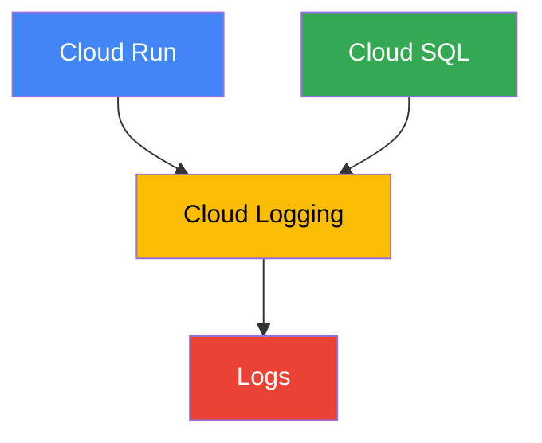
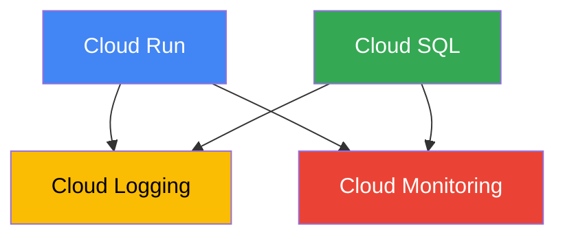
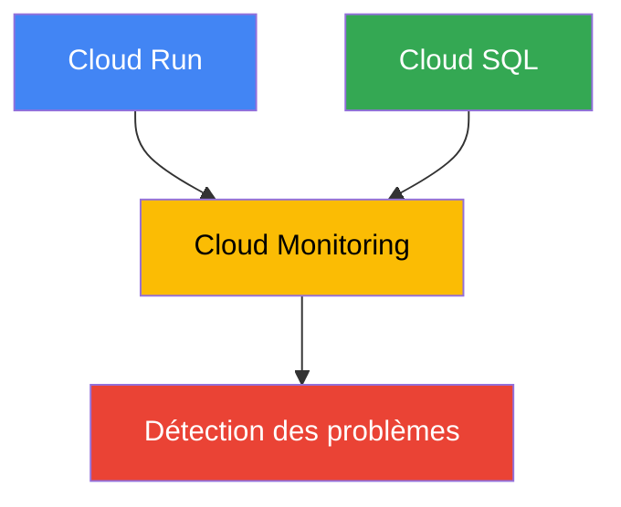
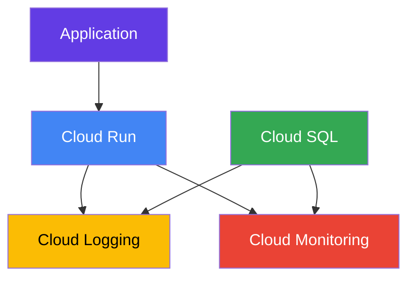

# Module Observability

Le module `observability` permet de gérer la supervision et la collecte des logs de l'infrastructure MediRDV sur Google Cloud.

## Objectif

L'objectif du module est de permettre le suivi de l'état et des performances de l'application et de la base de données grâce aux services Google Cloud :

- Cloud Logging pour la collecte et la consultation des logs ;
- Cloud Monitoring pour la supervision et le suivi des métriques.

## Architecture


## Structure du module

observability/ 
├── [`main.tf`](./main.tf) 
├── [`variables.tf`](./variables.tf) 
└── [`outputs.tf`](./outputs.tf) 

## `main.tf`

Le fichier [`main.tf`](./main.tf) configure les ressources nécessaires à la supervision.

Il permet notamment de récupérer les logs provenant de :

- Cloud Run ;
- Cloud SQL.

Un **Log Sink** est configuré afin de centraliser les événements importants de l'infrastructure.

## Cloud Logging

Cloud Logging permet de consulter les logs générés par les services Google Cloud.

Les logs permettent notamment de suivre :

- les erreurs de l'application ;
- les événements Cloud Run ;
- les événements Cloud SQL ;
- les problèmes liés à l'infrastructure.

### Centralisation des logs

Les logs provenant de Cloud Run et Cloud SQL sont centralisés dans Cloud Logging.


## Cloud Monitoring

Cloud Monitoring permet de surveiller l'état et les performances des ressources Google Cloud.

Il peut notamment être utilisé pour surveiller :

- Cloud Run ;
- Cloud SQL ;
- les erreurs ;
- les métriques des ressources.

L'objectif est de pouvoir détecter rapidement un problème sur l'infrastructure.

### Supervision


## `variables.tf`

Le fichier [`variables.tf`](./variables.tf) définit les paramètres nécessaires au module.

Actuellement, le module utilise la variable suivante :

| Variable | Type | Description |
| :--- | :---: | ---: |
| `project_id` | `string` | ID du projet Google Cloud sur lequel la supervision est configurée |

Cette variable permet d'indiquer le projet Google Cloud sur lequel les ressources d'observabilité doivent être configurées.

## `outputs.tf`

Le fichier [`outputs.tf`](./outputs.tf)  retourne les informations utiles du module.

| Output | Description |
| --- | --- |
| `log_sink_name` | Nom du Log Sink créé par le module |

## Dépendances

Le module `observability` fonctionne indépendamment des autres modules Terraform, mais il est déployé dans le même projet Google Cloud.



## Sécurité

La supervision permet notamment de :

- détecter les erreurs ;
- suivre les événements de sécurité ;
- surveiller les ressources ;
- faciliter le diagnostic en cas de problème ;
- conserver une visibilité sur l'infrastructure.

## Utilisation

Le module est appelé depuis le `main.tf` à la racine du projet :

```
module "observability" {
  source = "./modules/observability"

  project_id = var.project_id
}
```

## Déploiement

Le module est déployé avec l'infrastructure globale.

### Vérifier la configuration

```
terraform validate
```

### Générer le plan

```
terraform plan
```

### Déployer l'infrastructure

```
terraform apply
```

Pour appliquer automatiquement sans confirmation :

```
terraform apply -auto-approve
```

## Résumé

Le module `observability` permet de centraliser et de superviser les informations provenant de l'infrastructure MediRDV.

Il s'appuie principalement sur :

- **Cloud Logging** pour la collecte et la consultation des logs ;
- **Cloud Monitoring** pour la surveillance des ressources et des métriques ;
- un **Log Sink** pour la centralisation des événements nécessaires à l'observabilité.


