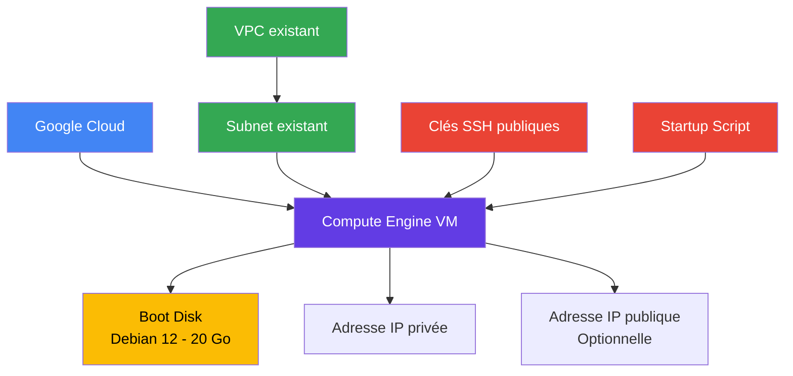

# Module VM

Le module `vm` permet de déployer une machine virtuelle Google Compute Engine sur Google Cloud Platform (GCP) à l'aide de Terraform.

La VM est configurable avec :

- le type de machine ;
- la zone Google Cloud ;
- le sous-réseau utilisé ;
- une adresse IP privée statique optionnelle ;
- une adresse IP publique optionnelle ;
- des tags réseau ;
- des clés SSH publiques ;
- un script de démarrage ;
- un disque système Debian 12.

## Architecture



## Objectif

Ce module permet de créer une machine virtuelle de manière reproductible et configurable avec Terraform.

La configuration réseau permet de choisir si la VM doit disposer :

- d'une adresse IP privée attribuée automatiquement ;
- d'une adresse IP privée définie manuellement ;
- d'une adresse IP privée et d'une adresse IP publique.

Par défaut, aucune adresse IP publique n'est attribuée par le module.

## Ressources créées

Le module crée la ressource principale suivante :

| Ressource | Description |
| --- | --- |
| `google_compute_instance.vm` | Crée et configure une machine virtuelle Compute Engine |

Le module utilise un sous-réseau existant. Il ne crée pas de VPC ni de sous-réseau.

## Structure du module

```
vm/
├── main.tf
├── variables.tf
├── outputs.tf
└── README.md
```

## `main.tf`

Le fichier [`main.tf`](./main.tf) contient la définition de la machine virtuelle.

La VM est configurée avec :

- une image Debian 12 ;
- un disque de démarrage de 20 Go ;
- un disque de type `pd-balanced` ;
- un type de machine configurable ;
- une zone configurable ;
- un sous-réseau existant ;
- une adresse IP privée configurable ;
- une adresse IP publique optionnelle ;
- des tags réseau ;
- des clés SSH publiques ;
- un script de démarrage.

### Système d'exploitation

La machine virtuelle utilise l'image Debian 12 :

```
image = "debian-cloud/debian-12"
```

Le disque système est configuré comme suit :

| Configuration | Valeur |
| --- | --- |
| Système d'exploitation | Debian 12 |
| Taille du disque | 20 Go |
| Type du disque | `pd-balanced` |

### Type de machine

Le type de machine est défini par la variable `machine_type`.

Sa valeur par défaut est :

```
machine_type = "e2-medium"
```

Cette valeur peut être remplacée lors de l'appel du module.

### Configuration réseau

La VM utilise un sous-réseau existant défini par la variable `subnetwork`.

```
network_interface {
  subnetwork = var.subnetwork

  network_ip = var.network_ip != "" ? var.network_ip : null

  dynamic "access_config" {
    for_each = var.public_ip ? [1] : []

    content {}
  }
}
```

Le module ne crée pas lui-même le VPC ni le sous-réseau.

### Adresse IP privée

La variable `network_ip` permet de définir une adresse IP privée pour la VM.

```
network_ip = ""
```

Lorsque cette variable est vide, Terraform transmet `null` à la configuration réseau et Google Cloud attribue automatiquement une adresse IP privée.

Pour définir une adresse IP privée spécifique :

```
network_ip = "10.10.0.10"
```

L'adresse choisie doit être disponible et appartenir à la plage IP du sous-réseau utilisé.

### Adresse IP publique

La variable `public_ip` contrôle l'attribution d'une adresse IP publique.

```
public_ip = false
```

Par défaut, cette option est désactivée.

Lorsque `public_ip` vaut `true`, le bloc `access_config` est créé :

```
dynamic "access_config" {
  for_each = var.public_ip ? [1] : []

  content {}
}
```

Google Cloud peut alors attribuer une adresse IPv4 publique éphémère à la VM.

>**Attention :** une adresse IP publique ne signifie pas que tous les ports de la machine sont accessibles depuis Internet. L'accès dépend également des règles de pare-feu et des autres contrôles réseau.

## Accès SSH

Les clés SSH publiques sont fournies à l'aide de la variable `ssh_public_keys`.

```
metadata = {
  ssh-keys = join("\n", var.ssh_public_keys)
}
```

Cette configuration rassemble les clés fournies dans une chaîne séparée par des retours à la ligne et les place dans les métadonnées de la VM.

Exemple :

```
ssh_public_keys = [
  "admin:ssh-ed25519 AAAAC3NzaC1lZDI1NTE5AAAA...",
  "developer:ssh-ed25519 AAAAC3NzaC1lZDI1NTE5AAAA..."
]
```

Chaque entrée suit le format attendu par les métadonnées SSH de Compute Engine.

L'accès effectif dépend également des paramètres SSH du projet et de l'instance, des règles de pare-feu et de la configuration du système invité.

## Script de démarrage

Le module accepte un script de démarrage grâce à la variable `startup_script`.

```
metadata_startup_script = var.startup_script
```

Ce script peut automatiser certaines tâches lors du démarrage de la VM, par exemple l'installation de paquets.

Exemple :

```
startup_script = <<-EOF
#!/bin/bash
apt-get update
apt-get install -y nginx
EOF
```

Le script est transmis à la VM par les métadonnées de Compute Engine et exécuté par l'environnement invité lorsque les conditions de démarrage le permettent.

## `variables.tf`

Le fichier [`variables.tf`](./variables.tf) définit les paramètres nécessaires au déploiement.

| Variable | Type | Valeur par défaut | Description |
| --- | --- | --- | --- |
| `project_id` | `string` | Aucune | Identifiant du projet Google Cloud |
| `name` | `string` | Aucune | Nom de la VM |
| `machine_type` | `string` | `e2-medium` | Type de machine Compute Engine |
| `zone` | `string` | Aucune | Zone Google Cloud |
| `subnetwork` | `string` | Aucune | Sous-réseau utilisé par la VM |
| `network_ip` | `string` | `""` | Adresse IP privée souhaitée |
| `instance_tags` | `list(string)` | `[]` | Tags réseau de la VM |
| `public_ip` | `bool` | `false` | Active ou désactive l'IP publique |
| `ssh_public_keys` | `list(string)` | Aucune | Liste des clés SSH publiques |
| `startup_script` | `string` | `""` | Script de démarrage |

Les variables sans valeur par défaut doivent être renseignées lors de l'utilisation du module.

## `outputs.tf`

Le fichier [`outputs.tf`](./outputs.tf) expose les informations utiles concernant la VM après son déploiement.

| Output | Description |
| --- | --- |
| `instance_id` | Identifiant de la VM Compute Engine |
| `instance_name` | Nom de la VM |
| `internal_ip` | Adresse IP privée de la VM |
| `external_ip` | Adresse IP publique, ou `null` si elle n'est pas configurée |

### Récupérer les outputs

Pour afficher toutes les valeurs disponibles :

```bash
terraform output
```

Pour récupérer l'identifiant de la VM :

```bash
terraform output instance_id
```

Pour récupérer son nom :

```bash
terraform output instance_name
```

Pour récupérer son adresse IP privée :

```bash
terraform output internal_ip
```

Pour récupérer son adresse IP publique :

```bash
terraform output external_ip
```

L'output `external_ip` utilise la fonction Terraform `try()` afin de retourner `null` lorsqu'aucune configuration `access_config` n'est présente.

## Exemple d'utilisation

Le module peut être appelé depuis le fichier `main.tf` à la racine du projet :

```
module "vm" {
  source = "./modules/vm"

  project_id   = var.project_id
  name         = "medirdv-vm"
  machine_type = "e2-medium"
  zone         = "europe-west1-b"
  subnetwork   = var.subnetwork

  network_ip = ""

  public_ip = false

  instance_tags = [
    "medirdv",
    "application"
  ]

  ssh_public_keys = [
    "admin:ssh-ed25519 AAAAC3NzaC1lZDI1NTE5AAAA..."
  ]

  startup_script = <<-EOF
    #!/bin/bash
    apt-get update
    apt-get install -y nginx
  EOF
}
```

Dans cet exemple :

- la VM est déployée dans le projet indiqué ;
- la machine utilise le type `e2-medium` ;
- le sous-réseau est fourni par la configuration racine ;
- une adresse IP privée est attribuée automatiquement ;
- aucune adresse IP publique n'est demandée ;
- une clé SSH publique est ajoutée aux métadonnées ;
- Nginx est installé par le script de démarrage.

La clé SSH présentée est un exemple fictif et doit être remplacée par une clé publique valide.

## Exemple de fichier `terraform.tfvars`

Les variables du module racine peuvent être renseignées dans un fichier `terraform.tfvars`.

```
project_id = "mon-projet-gcp"

subnetwork = "projects/mon-projet-gcp/regions/europe-west1/subnetworks/mon-subnet"
```

Les autres paramètres peuvent être définis directement dans l'appel du module, comme dans l'exemple précédent.

**Attention :** ne stockez pas de clés privées SSH, de mots de passe ou d'autres secrets dans un fichier `terraform.tfvars` versionné dans Git.

## Prérequis

Avant d'utiliser ce module, il faut disposer de :

- Terraform installé ;
- un projet Google Cloud ;
- les API Google Cloud nécessaires activées, notamment Compute Engine API ;
- les permissions IAM nécessaires à la création de machines virtuelles ;
- un VPC et un sous-réseau existants ;
- une adresse IP privée disponible si une adresse spécifique est demandée ;
- une clé SSH publique valide si l'accès SSH par clé est nécessaire.

## Déploiement

Le déploiement peut être effectué depuis le répertoire racine du projet Terraform.

### 1\. Initialiser Terraform

```bash
terraform init
```

### 2\. Vérifier la configuration

```bash
terraform validate
```

### 3\. Générer le plan

```bash
terraform plan
```

### 4\. Déployer la VM

```bash
terraform apply
```

Pour appliquer sans confirmation interactive :

```bash
terraform apply -auto-approve
```

>L'option `-auto-approve` doit être utilisée avec précaution, particulièrement dans un environnement de production.

## Sécurité et bonnes pratiques

Le module permet de limiter l'exposition réseau de la VM en désactivant l'attribution d'une adresse IP publique par défaut.

Il est recommandé de :

- conserver `public_ip = false` lorsque l'accès public n'est pas nécessaire ;
- contrôler les règles de pare-feu associées aux tags réseau ;
- privilégier un accès SSH privé ou via Identity-Aware Proxy (IAP) lorsque cela correspond à l'architecture ;
- utiliser uniquement des clés SSH publiques valides ;
- protéger les clés privées SSH ;
- vérifier les scripts de démarrage avant leur exécution ;
- contrôler les permissions IAM attribuées aux utilisateurs et aux services ;
- définir une adresse IP privée statique uniquement lorsque cela est nécessaire.

### Limites de la configuration actuelle

Le code Terraform fourni ne configure pas directement :

- les règles de pare-feu ;
- un accès SSH via IAP ;
- une adresse IP publique statique réservée ;
- un compte de service dédié à la VM ;
- la protection contre la suppression de la VM ;
- une configuration de sauvegarde du disque.

Ces éléments doivent être configurés séparément si l'architecture en a besoin.

## Suppression

Pour supprimer la VM gérée par Terraform :

```bash
terraform destroy
```

Pour supprimer les ressources sans confirmation interactive :

```bash
terraform destroy -auto-approve
```

>**Attention :** la suppression de la VM peut entraîner la perte des données présentes sur ses disques, selon leur configuration et leur cycle de vie. Vérifiez les besoins de sauvegarde avant de supprimer une machine utilisée en production.

## Résumé

Le module `vm` permet de déployer une machine virtuelle Google Compute Engine configurable sur Google Cloud.

Il fournit :

- une VM Debian 12 ;
- un disque système de 20 Go de type `pd-balanced` ;
- un type de machine configurable, avec `e2-medium` par défaut ;
- une zone et un sous-réseau configurables ;
- une adresse IP privée configurable ;
- une adresse IP publique optionnelle, désactivée par défaut ;
- des tags réseau ;
- des clés SSH publiques dans les métadonnées ;
- un script de démarrage ;
- quatre outputs pour récupérer les informations principales de la VM.

