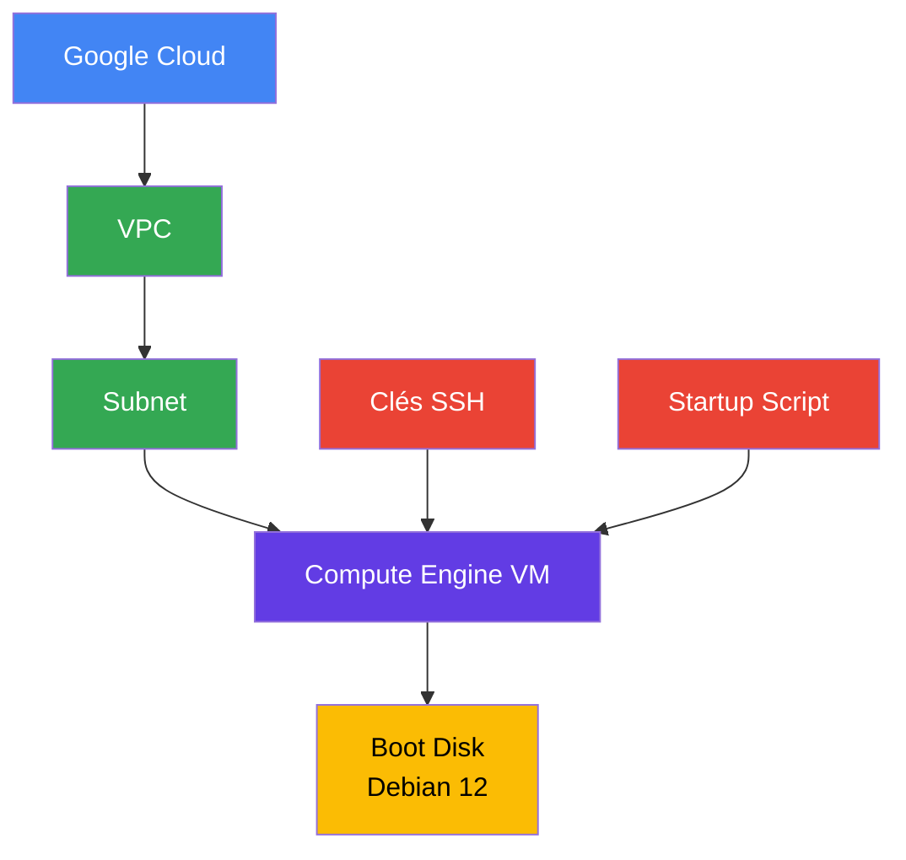
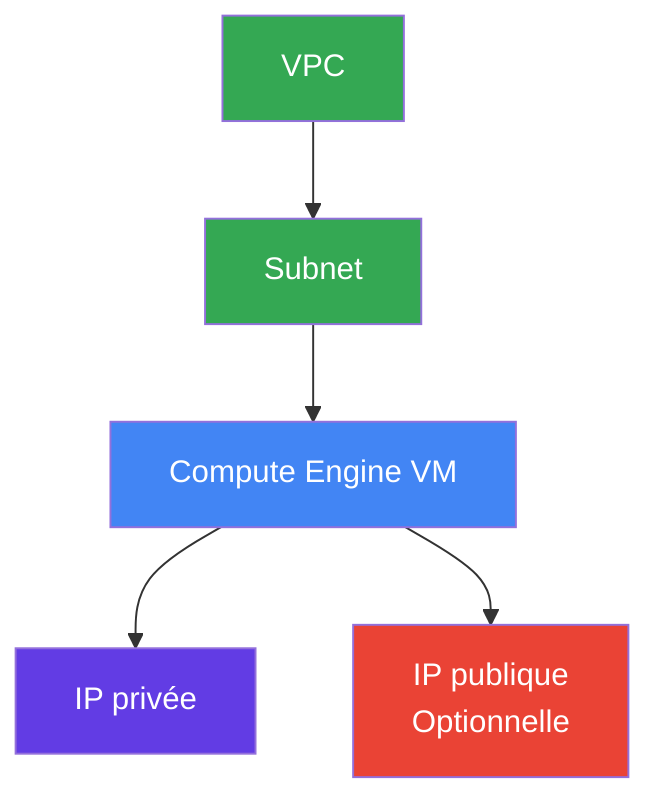

# Module VM

Le module `vm` permet de déployer une machine virtuelle Compute Engine sur Google Cloud Platform (GCP).

La VM est configurable avec :

- le type de machine ;
- la zone GCP ;
- le subnet utilisé ;
- une adresse IP privée statique optionnelle ;
- une adresse IP publique optionnelle ;
- des tags réseau ;
- des clés SSH publiques ;
- un script de démarrage ;
- un disque système Debian 12.

## Architecture



## Objectif

Ce module permet de créer une VM Google Compute Engine de manière reproductible avec Terraform.

La configuration réseau permet de choisir si la VM doit disposer :

- uniquement d'une adresse IP privée ;
- d'une adresse IP privée et d'une adresse IP publique ;
- d'une adresse IP privée définie manuellement.

## Ressources créées

Le module crée la ressource principale suivante :

| Ressource | Description |
|---|---|
| `google_compute_instance.vm` | Crée une machine virtuelle Compute Engine |

## Structure du module

vm/ 
├── main.tf 
├── variables.tf 
└── outputs.tf


## `main.tf`

Le fichier [`main.tf`](./main.tf) contient la définition de la VM Google Compute Engine.

La VM est configurée avec :

- Debian 12 ;
- un disque de démarrage de 20 Go ;
- un disque de type `pd-balanced` ;
- un type de machine configurable ;
- un subnet configurable ;
- une adresse IP privée optionnelle ;
- une adresse IP publique optionnelle ;
- des tags réseau ;
- des clés SSH ;
- un script de démarrage.

### Configuration Terraform

```

resource "google_compute_instance" "vm" { project = var.project_id name = var.name machine_type = var.machine\_type zone = var.zone

tags = var.instance\_tags

boot_disk { initialize_params { image = "debian-cloud/debian-12" size = 20 type = "pd-balanced" } }

network\_interface { subnetwork = var.subnetwork

network_ip = var.network_ip != "" ? var.network\_ip : null

dynamic "access_config" { for_each = var.public\_ip ? \[1\] : \[\]

content {} } }

metadata = { ssh-keys = join("\\n", var.ssh_public_keys) }

metadata_startup_script = var.startup\_script }

```

## Système d'exploitation

La VM utilise l'image officielle Debian 12 :

image = "debian-cloud/debian-12"


Le disque système est configuré avec :

| Configuration | Valeur |
|---|---|
| Système | Debian 12 |
| Taille | 20 Go |
| Type | `pd-balanced` |

## Configuration réseau

La VM est connectée à un subnet existant grâce à la variable `subnetwork`.

network_interface { subnetwork = var.subnetwork }


### Adresse IP privée

Une adresse IP privée peut être définie manuellement avec `network_ip`.

```
networkip = var.networkip != "" ? var.network_ip : null
```

Si aucune adresse IP n'est fournie, Google Cloud attribue automatiquement une adresse IP privée.

### Adresse IP publique

L'adresse IP publique est contrôlée par la variable `public_ip`.

```
dynamic "accessconfig" { foreach = var.public_ip ? [1] : []

content {} }
```

Par défaut :
```
public_ip = false
```

La VM n'a donc pas d'adresse IP publique par défaut.

### Architecture réseau




> L'adresse IP publique est optionnelle et désactivée par défaut.

## Accès SSH

Les clés SSH publiques sont fournies via la variable `ssh_public_keys`.

metadata = { ssh-keys = join("\n", var.sshpublickeys) }


Plusieurs clés SSH peuvent être configurées.

Exemple :
```
sshpublickeys = [ 
    "admin:ssh-ed25519 AAAAC3NzaC1lZDI1NTE5AAAA...", 
    "developer:ssh-ed25519 AAAAC3NzaC1lZDI1NTE5AAAA..." ]
```


Les clés sont ajoutées aux métadonnées de la VM.

## Startup Script

Le module permet également de fournir un script de démarrage avec la variable `startup_script`.
```

metadatastartupscript = var.startup_script
```


Exemple :
```

startup_script = <<-EOF #!/bin/bash

apt-get update apt-get install -y nginx EOF
```


Le script est exécuté au démarrage de la VM.

## `variables.tf`

Le fichier [`variables.tf`](./variables.tf) définit les paramètres nécessaires au module.

| Variable | Type | Valeur par défaut | Description |
|---|---|---|---|
| `project_id` | `string` | — | ID du projet GCP |
| `name` | `string` | — | Nom de la VM |
| `machine_type` | `string` | `e2-medium` | Type de machine |
| `zone` | `string` | — | Zone de la VM |
| `subnetwork` | `string` | — | Subnet utilisé par la VM |
| `network_ip` | `string` | `""` | Adresse IP privée |
| `instance_tags` | `list(string)` | `[]` | Tags réseau |
| `public_ip` | `bool` | `false` | Active ou non une IP publique |
| `ssh_public_keys` | `list(string)` | — | Clés SSH publiques autorisées |
| `startup_script` | `string` | `""` | Script exécuté au démarrage |

### Définition des variables
```
variable "project_id" { description = "ID du projet GCP" type = string }

variable "name" { description = "Nom de la VM" type = string }

variable "machine_type" { description = "Type de machine" type = string default = "e2-medium" }

variable "zone" { description = "Zone de la VM" type = string }

variable "subnetwork" { description = "Subnet de la VM" type = string }

variable "network_ip" { description = "Adresse IP privée" type = string default = "" }

variable "instance_tags" { description = "Tags réseau" type = list(string) default = [] }

variable "public_ip" { description = "Attribuer une IP publique" type = bool default = false }

variable "sshpublickeys" { description = "Clés SSH publiques autorisées" type = list(string) }

variable "startup_script" { description = "Script de démarrage" type = string default = "" }
```


## `outputs.tf`

Le fichier [`outputs.tf`](./outputs.tf) expose les informations utiles concernant la VM après son déploiement.

| Output | Description |
|---|---|
| `instance_id` | ID de l'instance Compute Engine |
| `instance_name` | Nom de la VM |
| `internal_ip` | Adresse IP privée de la VM |
| `external_ip` | Adresse IP publique de la VM, si elle existe |

### Définition des outputs
```
output "instanceid" { value = googlecompute_instance.vm.id }

output "instancename" { value = googlecompute_instance.vm.name }

output "internalip" { value = googlecomputeinstance.vm.networkinterface[0].network_ip }

output "externalip" { value = try( googlecomputeinstance.vm.networkinterface[0].accessconfig[0].natip, null ) }

```

## Exemple d'utilisation

Le module peut être appelé depuis le `main.tf` à la racine du projet.
```
module "vm" { source = "./modules/vm"

projectid = var.projectid name = "medirdv-vm" machine_type = "e2-medium" zone = "europe-west1-b" subnetwork = var.subnetwork

public_ip = false

instance_tags = [ "medirdv", "application" ]

sshpublickeys = [ "admin:ssh-ed25519 AAAAC3NzaC1lZDI1NTE5AAAA..." ]

startup_script = <<-EOF #!/bin/bash

apt-get update apt-get install -y nginx EOF }
```


## Exemple de variables

Un fichier `terraform.tfvars` peut être utilisé pour définir les valeurs :
```

projectid = "mon-projet-gcp" name = "medirdv-vm" machinetype = "e2-medium" zone = "europe-west1-b" subnetwork = "projects/mon-projet-gcp/regions/europe-west1/subnetworks/mon-subnet"

network_ip = ""

instance_tags = [ "medirdv", "application" ]

public_ip = false

sshpublickeys = [ "admin:ssh-ed25519 AAAAC3NzaC1lZDI1NTE5AAAA..." ]

startup_script = <<-EOF #!/bin/bash

apt-get update apt-get install -y nginx EOF
```


> **Attention :** Ne stockez pas de données sensibles dans `terraform.tfvars` si ce fichier est versionné dans Git.

## Déploiement

### Initialiser Terraform
```
terraform init
```


### Vérifier la configuration
```
terraform validate
```


### Générer le plan
```
terraform plan
```


### Déployer la VM
```
terraform apply
```


Pour appliquer automatiquement sans confirmation :
```
terraform apply -auto-approve
```


## Outputs

Après le déploiement, les informations de la VM peuvent être récupérées avec :

```
terraform output
```


### ID de l'instance
```
terraform output instance_id
```


### Nom de l'instance
```
terraform output instance_name
```


### Adresse IP privée
```
terraform output internal_ip
```

### Adresse IP publique
```
terraform output external_ip
```


Si la variable `public_ip` est définie à `false`, l'output `external_ip` retourne `null`.

## Sécurité

Le module applique plusieurs bonnes pratiques :

- l'adresse IP publique est désactivée par défaut ;
- la VM utilise un subnet existant ;
- les clés SSH sont configurables ;
- les tags réseau permettent de contrôler les règles firewall ;
- l'adresse IP privée peut être définie explicitement ;
- les scripts de démarrage peuvent automatiser la configuration de la VM.

Pour une infrastructure de production, il est recommandé de conserver :

```
public_ip = false
```

et de privilégier un accès privé à la VM.

## Suppression

Pour supprimer la VM :
```
terraform destroy
```

Terraform demandera une confirmation.

Pour supprimer automatiquement :
```
terraform destroy -auto-approve
```


> **Attention :** La suppression de la VM entraîne la suppression de l'instance Compute Engine gérée par Terraform.

## Résumé

Le module `vm` permet de déployer une machine virtuelle Compute Engine configurable sur Google Cloud.

Il fournit notamment :

- une VM Debian 12 ;
- un disque système `pd-balanced` de 20 Go ;
- un type de machine configurable ;
- une connexion à un subnet existant ;
- une IP privée configurable ;
- une IP publique optionnelle ;
- des tags réseau ;
- des clés SSH configurables ;
- un startup script ;
- des outputs permettant de récupérer les informations principales de la VM.